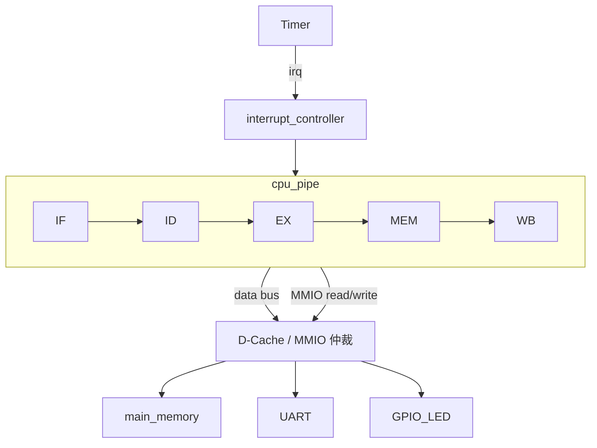

# 计算机系统结构课设 · 中期报告

> **题目**：基于 VHDL 的五级流水 RISC CPU 设计与存储/中断扩展——以斐波那契程序为验证负载  
> **姓名**：（填写）  
> **学号**：（填写）  
> **班级**：（填写）  
> **指导教师**：（填写）  
> **提交日期**：2026-06-10

---

## 摘要

本课设以《计算机组成原理》课程中已完成的**非流水线冯诺依曼架构模型机**为起点，在保持斐波那契为统一验证负载的前提下，递进实现五级流水 RISC CPU、Cache 存储层次、Timer 中断与 MMIO 最小 SoC。

**中期阶段已完成**：基础模型机分析、16 位 RISC 指令系统设计、五级流水 CPU 的 VHDL 实现（`cpu_pipe/rtl/`）、数据转发与 BNE 分支 flush、I/D 双 Cache 与 `soc_top` 系统集成，以及 ModelSim 斐波那契功能仿真。主存单端口争用导致的 I-Cache refill 异常已通过 `mem_grant` 仲裁修复。**尚待最终阶段完成**：load-use stall、Timer 中断、UART/GPIO MMIO 及 CPI/加速比实测。

**关键词**：五级流水线、RISC、数据转发、D-Cache、Timer 中断、MMIO

---

## 1. 课设背景与目标

### 1.1 课设背景

本课程设计属于**计算机系统结构**课程。项目基础为《计算机组成原理》实验中实现的**非流水线冯诺依曼架构模型机**：微程序控制器驱动单总线数据通路，经多周期串行执行完成取指—译码—执行；主存统一存放指令与数据，已能运行斐波那契计算程序。

课设要求在上述基础上完成递进扩展：以五级流水 CPU 为核心并处理流水线冒险；扩展 I/D Cache 并对比性能；实现 Timer 中断与最小 MMIO（UART/GPIO）；以斐波那契程序验证功能；提交中期/最终报告、RTL、仿真波形及 CPI/命中率分析。

### 1.2 升级动机

现有多周期模型机将一条指令拆成若干微周期串行完成，吞吐率低，无法指令重叠；微程序控制器 `microController` 与固定五级流水阶段不匹配；存储器直连主存、无 Cache，访存成为瓶颈；亦未实现外设与中断，难以演示真实嵌入式系统行为。

据此，升级方向为：用硬布线译码与流水线寄存器替代微程序控制，实现 IF/ID/EX/MEM/WB 五级重叠；在 MEM 级接入直接映射 D-Cache；增加 Timer 中断及 UART/GPIO 的 MMIO 映射，构成最小 SoC。

### 1.3 最终目标与优先级

```text
P0  五级流水 CPU + hazard 处理 + 斐波那契验证
P1  D-Cache（读命中/缺失、写直达、性能统计）
P2  Timer 中断（EPC/STATUS/IRET、精确中断）
P3  UART/GPIO 最小嵌入式演示
P4  向量/阵列等扩展（仅报告分析，可选）
```

### 1.4 验收标准（预期）

| 编号 | 验收项 | 预期结果 | 当前状态 |
|------|--------|----------|----------|
| V1 | 五级流水并行 | 波形中可见不同指令处于 IF/ID/EX/MEM/WB | ☑ 已实现 |
| V2 | 斐波那契正确性 | `x3 = 13`，`Mem[13..17] = 2,3,5,8,13` | ☑ 仿真通过 |
| V3 | RAW 转发 | `ForwardA/ForwardB` 波形可见 | ☑ 已实现 |
| V4 | load-use stall | `LD` 后接使用者 stall 1 拍 | ☐ 未实现 |
| V5 | 分支 flush | `BNE` 成立时 IF/ID、ID/EX 清空 | ☑ 已实现 |
| V6 | D-Cache 统计 | hit/miss/hit_rate 可观测 | ☑ 已实现 |
| V7 | Cache miss 等待 | `cpu_ready=0` 时流水线冻结 | ☑ 已实现 |
| V8 | Timer 中断 | PC 跳转 ISR，`IRET` 返回 | ☑ 已实现 |
| V9 | MMIO 输出 | UART/GPIO 写入有波形 | ☑ 已实现（RTL 就绪，ISR 可扩展 ST） |

---

## 2. 基础模型机分析

### 2.1 架构概述

基础模型机为典型的**冯诺依曼结构**：`main_memory` 统一存储指令与数据。数据通路以 `internal_bus` 单总线为核心，PC、MAR、MDR、AC、AX、BX、CX 等寄存器经多路选择器分时访问总线；ALU 完成加减与逻辑运算，并将 OpCode、`PSW_Z_flag` 反馈给控制器。

控制单元采用**微程序控制**：控制逻辑存于控制存储器 CM_ROM，执行流程为取指（固定微地址 0–3）→ 译码映射（按 OpCode 跳转）→ 执行微指令序列。条件分支 `JNZ` 依赖零标志实现循环。原系统框图见 **Fig-1**。

### 2.2 现有指令与执行特点

旧版指令集包含 LOAD、MOVE、INC、STORE、DEC、JNZ 等 9 条指令，以 4 位 OpCode 编码，面向斐波那契迭代（初始化 BX/CX、读内存、交换 AX/BX、写回、递减计数、条件跳转）。每条用户指令对应多拍微周期，寄存器与 ALU 通过总线分时复用，无指令级并行。

### 2.3 不足与改造策略

非流水线架构无法重叠执行；继续堆叠微指令难以适配固定五级流水；无 Cache、中断与外设接口。改造策略：新建流水线 RTL，按 IF/ID/EX/MEM/WB 拆分模块，ID 阶段硬布线译码；在 SoC 顶层逐级扩展 D-Cache、中断控制器与 MMIO 外设。

---

## 3. 总体架构设计

### 3.1 系统顶层结构



### 3.2 五级流水数据通路（已实现）

五级流水 CPU 已在 `cpu_pipe/rtl/cpu_top.vhd` 中实现并集成至 `soc_top.vhd`，数据通路见正文 **Fig-2 五级流水数据通路图**。

逻辑结构如下：PC 驱动 IF 经 I-Cache 取指，经 IF/ID、ID/EX、EX/MEM、MEM/WB 四级流水线寄存器依次传递；ID 读寄存器堆并产生控制信号，EX 执行 ALU 运算与分支判断（含转发 MUX），MEM 经 D-Cache 访存，WB 写回寄存器堆。控制由 `id_stage` 内硬布线译码产生；`forward_unit` 与 `hazard_unit` 分别处理 RAW 转发与 BNE flush；`cache_control` 在 I/D miss 时全局冻结流水线。

### 3.3 实际 RTL 目录结构

```text
cpu_pipe/
  rtl/
    cpu_top.vhd              # CPU 顶层（含四级流水线寄存器）
    if_stage.vhd             # 取指 + PC 更新
    id_stage.vhd             # 译码 + 寄存器堆 + 硬布线控制
    ex_stage.vhd             # ALU + 转发 MUX + 分支判断
    mem_stage.vhd            # 访存地址/数据通路
    wb_stage.vhd             # MemToReg 写回
    forward_unit.vhd         # RAW 转发控制
    hazard_unit.vhd          # BNE flush（load-use 待扩展）
    i_cache.vhd              # 直接映射 I-Cache
    d_cache.vhd              # 直接映射 D-Cache，写直达
    cache_control.vhd        # i_miss / cpu_ready → stall
    main_memory.vhd          # 统一主存（指令区 + 数据区）
    soc_top.vhd              # CPU + I/D Cache + 主存仲裁
  tb/
    tb_soc_top.vhd           # 斐波那契功能仿真
  sim/
    run.do                   # ModelSim 编译与波形脚本
```

寄存器堆、ALU 与控制译码内嵌于 `id_stage` / `ex_stage`，段间寄存器内嵌于 `cpu_top`，与初期规划的独立 `pipe_*.vhd` 模块功能等价。

### 3.4 中期实现对照

| 模块 | 规划 | 中期状态 | 说明 |
|------|------|----------|------|
| 五级流水骨架 | P0 | ☑ 完成 | IF/ID/EX/MEM/WB 五级重叠可见 |
| 硬布线控制 | P0 | ☑ 完成 | 内嵌于 `id_stage`，支持 ADDI/ADD/ST/BNE/J/HALT |
| 数据转发 | P0 | ☑ 完成 | `forward_unit.vhd` + EX 级 Forward MUX |
| BNE flush | P0 | ☑ 完成 | `hazard_unit.vhd`，EX 级判定 + IF/ID、ID/EX 冲刷 |
| J 跳转 flush | P0 扩展 | ☑ 完成 | ID 级判定，`pc_src=10` 跳转 |
| load-use stall | P0 | ☐ 未实现 | 斐波那契程序无 LD，暂不影响验证 |
| I-Cache | P1 | ☑ 完成 | 16 行 × 4 word，miss 时 refill |
| D-Cache | P1 | ☑ 完成 | 写直达，读 miss refill，`cpu_ready` 握手 |
| Cache_control | P1 | ☑ 完成 | `stall <= i_miss or (not cpu_ready)` |
| 主存仲裁 | P1 | ☑ 完成 | I-Cache 读优先，`mem_grant` 互斥授权 |
| 命中率统计 | P1 | ☑ 完成 | `d_cache` 输出 hit_count / miss_count / hit_rate |
| Timer 中断 | P2 | ☐ 未开始 | CSR / ISR 待实现 |
| UART/GPIO MMIO | P3 | ☐ 未开始 | 地址 0xFFxx 旁路待接入 |

---

## 4. 指令系统设计（已完成）

### 4.1 设计原则

新指令系统采用类 RISC 格式：寄存器堆 + ALU + Load/Store + 分支；16 位定长指令，含 R/I/S/B/J 五种编码格式；`x0` 恒为 0；立即数/偏移为 **6 位有符号补码**（−32～+31）。最小指令集先闭环斐波那契验证，再扩展 SYS 类指令（EI/DI/IRET）。

### 4.2 指令格式

| 格式 | opcode | rs1 | rs2 | rd | funct / imm / offset / target | 典型用途 |
|------|:------:|:---:|:---:|:--:|:-----------------------------:|----------|
| R 型 | 4 | 3 | 3 | 3 | funct(3) | 寄存器间运算（如 ADD） |
| I 型 | 4 | 3 | — | 3 | imm(6) | 立即数运算、加载（如 ADDI、LD） |
| S 型 | 4 | 3 | 3 | — | offset(6) | 存储（如 ST） |
| B 型 | 4 | 3 | 3 | — | offset(6) | 条件分支（如 BNE） |
| J 型 | 4 | — | — | — | target(12) | 无条件跳转（如 J） |

各型字段合计均为 16 bit。

### 4.3 指令集与 OpCode 编码

| OpCode (4b) | 助记符 | 格式 | funct / 子操作 | 说明 |
|-------------|--------|:----:|----------------|------|
| `0000` | ADDI | I | — | rd ← rs + imm |
| `0001` | ADD | R | `funct=000` ADD；`001` SUB（预留） | rd ← rs1 + rs2 |
| `0010` | LD | I | — | rd ← Mem[rs1 + offset] |
| `0011` | ST | S | — | Mem[rs1 + offset] ← rs2 |
| `0100` | BNE | B | — | if rs1 ≠ rs2 then PC ← PC + offset |
| `0101` | J | J | — | PC ← target |
| `1110` | SYS | I | `imm[2:0]`：`000`=EI，`001`=DI，`010`=IRET | 访问 CSR，不写通用寄存器 |
| `1111` | HALT | — | 全字段可忽略 | 停止仿真或 PC 自环 |

**ALUOp 编码（3b，与 funct 低 3 位共用）：**

| ALUOp | 运算 |
|-------|------|
| `000` | ADD（地址计算、算术） |
| `001` | SUB（预留） |
| `010` | AND（预留） |
| 其他 | 保留 |

### 4.4 寄存器约定

| 寄存器 | 别名 | 用途 |
|--------|------|------|
| x0 | zero | 恒为 0 |
| x1 | a | 当前 f[i] |
| x2 | b | 当前 f[i+1] |
| x3 | tmp | 新计算结果 |
| x4 | ptr | 数据写入地址指针 |
| x5 | cnt | 循环计数 |
| x6 | irq_cnt / uart | 中断计数或 UART 数据 |
| x7–x15 | — | 保留 / 扩展 |

### 4.5 斐波那契验证程序

CPU 功能：计算斐波那契数列第 n 项 \(f_n\)（0-based：n=0 → f₁，n=1 → f₂）。本设计固定计算第七项 \(f_7=13\)。`cnt` 表示待计算新项个数，取 n−2，循环体重复 5 次。初值 f₁、f₂ 可预置于 `Mem[11]`、`Mem[12]`，亦可用 `ADDI` 装入寄存器；计算结果 f₃、f₄、… 顺序写入 `Mem[13]`、`Mem[14]`、…

```asm
; 初始化
0:  ADDI x1, x0, 1          ; a = 1
1:  ADDI x2, x0, 1          ; b = 1
2:  ADDI x4, x0, 13         ; ptr = 13
3:  ADDI x5, x0, 5          ; cnt = n - 2

LOOP:
4:  ADD  x3, x1, x2         ; tmp = a + b
5:  ST   x3, 0(x4)          ; Mem[ptr] = tmp
6:  ADDI x1, x2, 0          ; a = b
7:  ADDI x2, x3, 0          ; b = tmp
8:  ADDI x4, x4, 1          ; ptr++
9:  ADDI x5, x5, -1         ; cnt--
10: BNE  x5, x0, LOOP       ; if cnt ≠ 0 goto LOOP（offset = −6）
11: HALT
```

### 4.6 主存布局与机器码

**指令区（地址 0～11）：**

| 地址 | 汇编 | 机器码 (16b) |
|:----:|------|:------------:|
| 0 | ADDI x1, x0, 1 | `0041` |
| 1 | ADDI x2, x0, 1 | `0081` |
| 2 | ADDI x4, x0, 13 | `010D` |
| 3 | ADDI x5, x0, 5 | `0145` |
| 4 | ADD x3, x1, x2 | `1298` |
| 5 | ST x3, 0(x4) | `38C0` |
| 6 | ADDI x1, x2, 0 | `0440` |
| 7 | ADDI x2, x3, 0 | `0680` |
| 8 | ADDI x4, x4, 1 | `0901` |
| 9 | ADDI x5, x5, -1 | `0B7F` |
| 10 | BNE x5, x0, LOOP | `4A3A` |
| 11 | HALT | `F000` |

**数据区：**

| 地址 | 内容 | 初值 / 运行结果 |
|:----:|------|----------------|
| 11 | f₁ | 1（可选预置） |
| 12 | f₂ | 1（可选预置） |
| 13 | f₃ | 运行后 = 2 |
| 14 | f₄ | 运行后 = 3 |
| 15 | f₅ | 运行后 = 5 |
| 16 | f₆ | 运行后 = 8 |
| 17 | f₇ | 运行后 = 13 |

编码说明：`imm/offset` 为 6 位有符号补码；`BNE` 的 `offset = target_pc − pc_BNE`（pc 为 BNE 指令地址，本程序中为 −6）。取指与访存采用哈佛接口，指令区与数据区地址独立编号。运行后 `x3 = 13`，`Mem[13..17] = 2, 3, 5, 8, 13`。

---

## 5. 五级流水 CPU 详细设计

### 5.1 各级功能

- **IF**：按 PC 取指，输出 instruction、PC+1  
- **ID**：译码、读寄存器堆，产生 imm 与各控制信号  
- **EX**：ALU 运算、分支比较与目标地址计算  
- **MEM**：经 D-Cache 完成 load/store  
- **WB**：将 ALU 结果或 load 数据写回寄存器堆  

段间流水线寄存器分别锁存：IF/ID（pc, instr）、ID/EX（操作数、rd、控制）、EX/MEM（alu_result、分支信息、控制）、MEM/WB（mem_data、alu_result、控制）。

### 5.2 控制信号与译码

ID 阶段 `control_unit` 根据 opcode 一次性产生 RegWrite、MemRead、MemWrite、MemToReg、ALUSrc、ALUOp、Branch、Jump，并随流水线寄存器向后传递，替代原微程序控制器中的 `uAR_reg`、`uIR_reg`、`CM_ROM`。

**各指令控制真值表：**

| 指令 | RegWrite | MemRead | MemWrite | MemToReg | ALUSrc | ALUOp | Branch | Jump |
|------|:--------:|:-------:|:--------:|:--------:|:------:|:-----:|:------:|:----:|
| ADDI | 1 | 0 | 0 | 0 | 1 | ADD | 0 | 0 |
| ADD | 1 | 0 | 0 | 0 | 0 | ADD | 0 | 0 |
| LD | 1 | 1 | 0 | 1 | 1 | ADD | 0 | 0 |
| ST | 0 | 0 | 1 | 0 | 1 | ADD | 0 | 0 |
| BNE | 0 | 0 | 0 | 0 | 0 | — | 1 | 0 |
| J | 0 | 0 | 0 | 0 | — | — | 0 | 1 |
| HALT | 0 | 0 | 0 | 0 | — | — | 0 | 0 |
| EI/DI/IRET | 0 | 0 | 0 | 0 | — | — | 0 | 0 |

---

## 6. 流水线冒险处理方案

### 6.1 数据冒险：转发（Forwarding）

典型 RAW 场景：`ADD x3, x1, x2` 后接 `ADDI x2, x3, 0`，EX 阶段需要尚未 WB 的 x3。转发路径为 EX/MEM.alu_result 与 MEM/WB.write_data 回注 EX 级 ALU 输入。

转发单元根据 ID/EX.rs1/rs2 与 EX/MEM.rd、MEM/WB.rd 比较，输出 ForwardA/ForwardB（00=ID/EX，01=EX/MEM，10=MEM/WB）。若 EX/MEM 为 load 指令（MemRead=1），其结果尚非最终数据，不可从 EX/MEM 转发；EX/MEM 与 MEM/WB 同时命中时 EX/MEM 优先。

### 6.2 数据冒险：load-use Stall

`LD` 后接下一条使用 load 结果的指令时，数据在 MEM 末才就绪。检测条件：ID/EX.MemRead=1 且 ID/EX.rd≠0，且 rd 等于 IF/ID 的 rs1 或 rs2。处理：stall 1 拍，冻结 PC 与 IF/ID，向 ID/EX 插入 bubble。

**中期状态**：转发单元已实现，但 `hazard_unit` 尚未扩展 load-use 检测。斐波那契验证程序仅使用 ADDI/ADD/ST，不涉及 LD，当前不影响功能正确性；含 LD 的测试程序留待最终阶段补充 stall 逻辑。

### 6.3 控制冒险：分支 Flush

BNE 在 EX 阶段比较 rs1、rs2，目标地址 `branch_target = ID/EX.pc + sign_ext(offset)`。采用静态不预测：分支成立时 PC ← target，IF/ID 与 ID/EX 清空为 NOP，代价 2 拍误取指。

### 6.4 冒险处理汇总

| 冒险类型 | 场景 | 处理策略 | 代价 |
|----------|------|----------|------|
| RAW（ALU→ALU） | ADD 后接 ADDI 用其结果 | 转发 | 0 周期 |
| RAW（Load→Use） | LD 后接下一条用 load 结果 | stall 1 拍 | 1 周期 |
| 控制冒险 | BNE 跳转 | flush 2 级 | 2 周期 |
| 结构冒险 | IF 取指与 MEM 访存争用 | 哈佛接口或 MEM 忙时停顿 IF | 0～1 周期 |

---

## 7. D-Cache 设计方案

### 7.1 设计要点

实现 **I-Cache** 与 **D-Cache**（均为直接映射）；D-Cache 采用**写直达**（write-through），写缺失不分配行（no-write-allocate）。参数：16 行 × 4 words/行 × 16 bit = 128 B 数据区；地址划分 tag(10) | index(4) | offset(2)。

读命中 1 周期返回；读缺失从主存 refill 4 words；写命中同时更新 Cache 与主存；写缺失直写主存。Cache 行含 valid、tag、data[0..3]（写直达下 dirty 可固定为 0）。

miss 时 `cpu_ready=0`，冻结 PC 与各流水线寄存器写入。地址 `0xFFxx` 绕过 D-Cache，直接访问 MMIO 外设。

### 7.2 性能指标（最终阶段实测）

计划统计 cache_access_count、hit/miss、hit_rate、miss_penalty、CPI 及相对无 Cache 的加速比；斐波那契、顺序访问、冲突访问三组对比。`d_cache.vhd` 已输出 `hit_count`、`miss_count`、`hit_rate`（命中率 × 100，8 bit）；CPI 与加速比留待最终阶段实测填表。

### 7.3 实现进展与调试记录

I-Cache 与 D-Cache 均已接入 `soc_top`，共用单端口 `main_memory`。集成过程中发现并修复了两类主存争用问题（详见 `doc/cache/Cache主存争用与mem_grant修复.md`）：

1. **I-Cache refill 读错**：PC=8 时 `debug_instr=0000`，因 I/D 同时访问主存时 refill 采到无效数据。修复：引入 `mem_grant` 互斥授权，仅在真实读周期占用总线。
2. **流水线永久 stall**：PC=7 卡死，`cache_stall` 持续为 1。修复：I-Cache 读优先，D-Cache 写可在 I-Cache 不读时进行；授权逻辑区分读/写周期。

修复后斐波那契程序在带 Cache 的 `soc_top` 上可正确跑通，`Mem[13..17]` 依次写入 2、3、5、8、13。

---

## 8. 中断系统设计

### 8.1 设计要点

中断源以 **Timer** 为主；单级中断，精确中断模型（指令边界响应 + 流水线 flush）。复位入口 `RESET_PC = 0x0000`，ISR 入口 `ISR_ADDR = 0x0100`。

CSR 含 EPC（16 bit，保存被中断指令下一条 PC）、STATUS（bit0 = 全局中断使能 IE）、CAUSE（bit0 = timer）。扩展指令 EI/DI/IRET 经 SYS（OpCode `1110`）实现，机器码示例：`E000`（EI）、`E001`（DI）、`E002`（IRET）。

### 8.2 响应流程

```mermaid
sequenceDiagram
    participant Main as 主程序
    participant Pipe as 流水线
    participant IRQ as 中断控制器
    participant ISR as 中断服务程序

    Main->>Pipe: 正常执行
    IRQ->>Pipe: irq_pending = 1
    Note over Pipe: MEM/WB 提交边界
    Pipe->>Pipe: EPC ← next_pc; STATUS.IE ← 0
    Pipe->>ISR: PC ← ISR_ADDR; flush 流水线
    ISR->>ISR: irq_count++ 等处理
    ISR->>Main: IRET: PC ← EPC; STATUS.IE ← 1
```

MEM/WB 阶段指令即将提交时，若 `irq_pending=1` 且 `STATUS.IE=1`，则保存 EPC/CAUSE、关中断、PC 跳转 ISR 并 flush 全部流水线；IRET 恢复 PC 与中断使能。验收现象：主程序斐波那契结果仍正确，x6 随 Timer 中断递增，波形可见 irq_pending、EPC、PC 跳转与返回。

> **实现文档**：`doc/中断/Timer精确中断实现.md`  
> **RTL**：`interrupt_controller.vhd`、`timer.vhd`、`uart_mmio.vhd`、`gpio_mmio.vhd`；`cpu_top` 内精确中断与 SYS 提交逻辑。

---

## 9. 最小嵌入式 SoC 设计

### 9.1 地址空间

| 地址范围 / 地址 | 设备 | 访问属性 |
|-----------------|------|----------|
| 0x0000 – 0x7FFF | RAM | 可 Cache |
| 0xFF00 | UART_DATA | MMIO，不 Cache |
| 0xFF04 | UART_STATUS | MMIO，不 Cache |
| 0xFF10 | GPIO_LED | MMIO，不 Cache |
| 0xFF20 | TIMER_CTRL | MMIO，不 Cache |
| 0xFF24 | TIMER_COUNT | MMIO，不 Cache |

UART 将写入数据锁存至 `uart_data_reg`；GPIO 驱动 `led_reg`；Timer 每 N 周期置位 `irq_timer`。

### 9.2 演示场景

复位后 EI 开中断 → 主程序运行斐波那契 → Timer 周期性中断，ISR 中 x6 递增 → IRET 返回不破坏主程序状态 → 经 MMIO 将结果写入 UART/GPIO → HALT。

---

## 10. 仿真验证进展

仿真环境：VHDL + ModelSim/Questa。顶层 `soc_top`，测试平台 `cpu_pipe/tb/tb_soc_top.vhd`，脚本 `cpu_pipe/sim/run.do`。

### 10.1 已完成的验证

| 步骤 | 测试内容 | 结果 |
|------|----------|------|
| T1 | 单条 ADDI 写回 | 通过 |
| T2 | ADD + ADDI 写回链 | 通过 |
| T3 | ST 写主存 | 通过 |
| T4 | 3～5 条指令流水重叠 | 通过，IF/ID/EX/MEM/WB 同拍可见不同指令 |
| T5 | RAW 转发（ADD → ADDI 用 x3） | 通过，`forward_a/forward_b = 01` |
| T6 | BNE 循环跳转 + flush | 通过，PC 回到 0x04 |
| T7 | 完整斐波那契（含 Cache） | 通过，`Mem[13..17] = 2,3,5,8,13` |
| T8 | I/D Cache miss stall | 通过，`cache_stall` 与 refill 对齐 |
| T9 | D-Cache hit/miss 统计 | 通过，波形可观测 `hit_count` / `miss_count` / `hit_rate` |

必采信号：`clk`、`debug_pc`、`debug_instr`、EX 级 `forward_a/b`、`ex_branch_taken`、`cache_stall`、`i_miss`、`cpu_ready`、`hit_count`、`miss_count`、`hit_rate`、`mem_write_en`、`main_memory` 数据区。

### 10.2 待完成验证

- load-use stall（LD + 使用者紧邻）
- Timer 中断 + IRET 返回
- UART/GPIO MMIO 写入
- CPI / 加速比对比表（相对多周期模型机与无 Cache 版本）

性能分析公式：`实际周期 = 理想周期 + stall + flush + cache_miss_penalty`；最终报告补充实测数据与波形截图。

---

## 11. 实施计划与里程碑

| 周次 | 目标 | 主要交付 | 状态 |
|------|------|----------|------|
| 第 1 周 | 五级流水最小闭环 | 斐波那契结果正确，hazard 处理完成 | ☑ 完成 |
| 第 2 周 | I/D Cache | hit/miss 统计，miss 冻结流水线 | ☑ 完成 |
| 第 3 周 | 中断 + MMIO | Timer ISR、UART/GPIO 波形 | ☐ 进行中 |
| 第 4 周 | 报告 + 答辩 | 时空图、性能表、波形截图 | ☐ 未开始 |

第 1 周已完成：五级流水 RTL、转发、BNE/J flush，斐波那契 f7=13 仿真通过。第 2 周已完成：I/D Cache、`cache_control`、主存仲裁、`mem_grant` 修复及 D-Cache 命中率计数器。第 3～4 周计划：load-use stall、Timer 中断、MMIO 联调及 CPI/加速比对比报告。

---

## 12. 风险分析与备选方案

主要技术风险：微程序架构直接套壳不算流水线（必须有段间寄存器）；分支 flush 遗漏导致错指；Cache miss 未 stall 导致数据错误；MMIO 被 Cache 导致外设异常；中断非指令边界导致状态不一致；写回地址未从 MEM/WB.rd 取出导致写错寄存器。

**中期已解决**：主存单端口 I/D Cache 争用（`mem_grant` 仲裁）；RAW 转发与 BNE flush。**当前关注**：load-use stall 未实现时含 LD 程序会出错；MMIO 旁路与中断尚未接入。

---

## 13. 总结与展望

### 13.1 中期阶段已完成

- [x] 基础模型机（非流水线冯诺依曼架构）分析
- [x] 五级流水数据通路设计与 RTL 实现（`cpu_pipe/rtl/`）
- [x] 16 位 RISC 指令系统设计与机器码验证
- [x] 五级流水 CPU 仿真：斐波那契 f7=13 正确
- [x] RAW 数据转发（`forward_unit.vhd` + EX 级 MUX）
- [x] BNE 分支 flush 与 J 跳转 flush（`hazard_unit.vhd`）
- [x] I-Cache / D-Cache 直接映射实现（写直达）
- [x] `cache_control` 全局 stall 与 `soc_top` 主存仲裁
- [x] 主存争用 `mem_grant` 修复与功能回归
- [ ] load-use stall（最终阶段）
- [x] D-Cache 命中率统计（hit_count / miss_count / hit_rate）
- [ ] Timer 中断 + UART/GPIO MMIO（最终阶段）

### 13.2 后续工作

1. 扩展 `hazard_unit` 实现 load-use stall，并用含 LD 的测试程序验证  
2. 完成三组访存模式的 CPI 与加速比对比表（命中率已由 D-Cache 计数器提供）  
3. 实现 Timer、`interrupt_controller` 及 EPC/STATUS/IRET，联调中断演示程序  
4. 接入 UART/GPIO MMIO（0xFFxx 地址旁路 D-Cache）  
5. 整理 ModelSim 波形截图、五级流水时空图，撰写最终报告  

### 13.3 一句话总结（答辩可用）

> 本课设从组成原理课程的非流水线冯诺依曼模型机出发，中期已实现五级流水 CPU 核心（转发、分支 flush）、I/D 双 Cache 与 SoC 集成，并以斐波那契程序完成功能仿真；最终阶段将补全 load-use stall、Cache 性能量化、Timer 精确中断与 MMIO 最小嵌入式演示。

---

## 附录 A：五级流水时空图（斐波那契片段示意）

**理想重叠（无冒险，指令 1～4）：**

```text
周期:     1    2    3    4    5    6    7    8
ADDI x1: IF   ID   EX   MEM  WB
ADDI x2:      IF   ID   EX   MEM  WB
ADDI x4:           IF   ID   EX   MEM  WB
ADDI x5:                IF   ID   EX   MEM  WB
```

**RAW 转发（0x04 ADD → 0x06 ADDI 使用 x3）：**

```text
周期:     5    6    7    8    9
ADD x3:       EX   MEM  WB
ADDI x2,x3:        EX←转发 EX/MEM.alu_result
                   (ForwardA/B = 01)
```

**BNE 成立 flush（0x0A，目标 0x04）：**

```text
周期:     N    N+1  N+2  N+3
BNE:      EX   (判 taken)
误取指:        IF/ID=NOP, ID/EX=NOP
正确路径:           PC←0x04, loop 重新 IF
代价: 2 拍气泡 + 重新填充流水
```

最终报告需用 ModelSim 截图替换为实测周期对齐图。中期仿真已确认 ADD→ADDI 转发路径（`forward_a = 01`）与 BNE flush 行为与上述示意一致。

---

## 附录 B：参考文献

1. 王党辉等，《计算机组成原理》  
2. Hennessy & Patterson，《计算机体系结构：量化研究方法》

---

## 附录 C：插图清单

| 编号 | 图名 | 来源 / 状态 |
|------|------|-------------|
| Fig-1 | 非流水线冯诺依曼模型机框图 | 组成原理实验资料 |
| Fig-2 | 五级流水 CPU 数据通路图 | 已完成，待插入正文 |
| Fig-3 | SoC 顶层连接图 | 本文 3.1 节 Mermaid |
| Fig-4 | 中断响应时序图 | 本文 8.2 节 Mermaid（中断待实现） |
| Fig-5 | 五级流水时空图 | 附录 A；中期仿真已验证，待插入截图 |
| Fig-6 | Cache miss + stall 波形 | `doc/cache/attachments/cache.png` |
