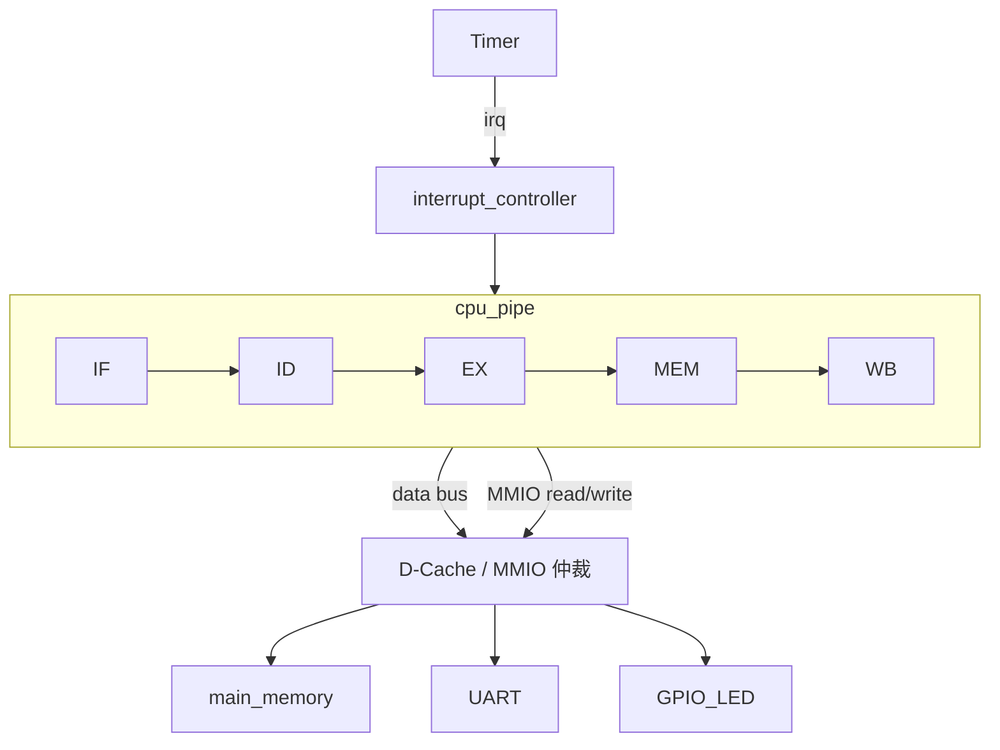

# 计算机系统结构课设 · 初期报告

> **题目**：基于 VHDL 的五级流水 RISC CPU 设计与存储/中断扩展——以斐波那契程序为验证负载  
> **姓名**：（填写）  
> **学号**：（填写）  
> **班级**：（填写）  
> **指导教师**：（填写）  
> **提交日期**：2026-06-03

---

## 摘要

本课设以参考工程 `doc/reference/cpu_fibo` 中的 VHDL 多周期微程序 CPU 为起点，该 CPU 采用单总线数据通路、32 位微命令控制，可完成斐波那契第 7 项（\(f_7=13\)）的计算与主存写回。升级目标是在保持斐波那契为统一验证负载的前提下，依次实现五级流水 RISC CPU（硬布线控制、数据转发、load-use 停顿、分支 flush）、直接映射 D-Cache（写直达与性能统计）、Timer 精确中断（EPC/STATUS/IRET）以及 UART/GPIO 最小 MMIO SoC。

初期阶段已完成：旧 CPU 分析、16 位 RISC 指令格式与 OpCode 定义、五级流水模块划分、冒险与 Cache/中断/MMIO 设计规格、斐波那契汇编及机器码表、分阶段仿真与四周实施计划。RTL 实现、波形截图、CPI/命中率实测数据留待后续阶段在 `rtl_pipe/` 与最终报告中补充。

**关键词**：五级流水线、RISC、数据转发、D-Cache、Timer 中断、MMIO

---

## 1. 课设背景与目标

### 1.1 课设背景

| 项目 | 内容 |
|------|------|
| 课程名称 | 计算机系统结构 |
| 参考工程 | `final/doc/reference/cpu_fibo` |
| 现有能力 | 微程序控制、微命令控制、单总线、多周期 CPU，可运行斐波那契程序 |
| 课设要求 | 以五级流水 CPU 为核心，完成冒险处理；扩展 D-Cache 并对比性能；实现 Timer 中断与最小 MMIO（UART/GPIO）；以斐波那契程序验证功能；提交初期/最终报告、RTL、仿真波形及 CPI/命中率分析 |

### 1.2 升级动机

| 现有多周期 CPU 特点 | 局限性 | 升级方向 |
|---------------------|--------|----------|
| 一条指令拆成多个微周期 | 吞吐率低，无法指令重叠 | 五级流水 IF/ID/EX/MEM/WB |
| 微程序控制器 `microController` | 不适合固定流水阶段 | 硬布线译码 + 流水线寄存器 |
| 统一主存，无 Cache | 访存成为瓶颈 | 直接映射 D-Cache |
| 无外设与中断 | 无法演示真实系统行为 | Timer 中断 + UART/GPIO MMIO |

### 1.3 最终目标与优先级

```text
P0  五级流水 CPU + hazard 处理 + 斐波那契验证
P1  D-Cache（读命中/缺失、写直达、性能统计）
P2  Timer 中断（EPC/STATUS/IRET、精确中断）
P3  UART/GPIO 最小嵌入式演示
P4  向量/阵列等扩展（仅报告分析，可选）
```

### 1.4 验收标准（预期）

| 编号 | 验收项 | 预期结果 | 当前状态 |
|------|--------|----------|----------|
| V1 | 五级流水并行 | 波形中可见不同指令处于 IF/ID/EX/MEM/WB | ☐ 未开始 |
| V2 | 斐波那契正确性 | `x3 = 13`，`Mem[13..17] = 2,3,5,8,13` | ☐ 未开始 |
| V3 | RAW 转发 | `ForwardA/ForwardB` 波形可见 | ☐ 未开始 |
| V4 | load-use stall | `LD` 后接使用者 stall 1 拍 | ☐ 未开始 |
| V5 | 分支 flush | `BNE` 成立时 IF/ID、ID/EX 清空 | ☐ 未开始 |
| V6 | D-Cache 统计 | hit/miss/hit_rate 可观测 | ☐ 未开始 |
| V7 | Cache miss 等待 | `dcache_ready=0` 时流水线冻结 | ☐ 未开始 |
| V8 | Timer 中断 | PC 跳转 ISR，`IRET` 返回 | ☐ 未开始 |
| V9 | MMIO 输出 | UART/GPIO 写入有波形 | ☐ 未开始 |

---

## 2. 现有微程序 CPU 分析

> 参考文档：`doc/0/base/斐波那契数列计算模型机.md`

### 2.1 现有系统框图

```text
                    +------------------+
                    | microController  |
                    | (CM_ROM 微程序)   |
                    +--------+---------+
                             | microCommands
                             v
    +----------+    internal_bus     +-------------+
    | PC/MAR/  |<------------------->|     ALU     |
    | MDR/IR/  |                     +-------------+
    | AC/AX/   |
    | BX/CX    |
    +----+-----+
         |
         v
    +----+-----+
    |main_memory|  指令 + 数据统一存储
    +-----------+
```

> 框图原图见 `doc/0/base/` 附件；参考工程 BDF 为 `doc/reference/cpu_fibo/rtl/cpu_fibo.bdf`。

### 2.2 现有指令系统（旧版）

| 助记符 | OpCode | 语义 |
|--------|--------|------|
| LOAD BX, imm | 0000 | BX ← imm |
| LOAD CX, imm | 0001 | CX ← imm |
| MOVE AC, [BX] | 0010 | AC ← Mem[BX] |
| INC AX | 0011 | AX ← AX + 1 |
| INC BX | 0100 | BX ← BX + 1 |
| MOVE AX, BX | 0101 | AX ← BX |
| STORE AC, [AX] | 0111 | Mem[AX] ← AC |
| DEC CX | 1000 | CX ← CX - 1 |
| JNZ LOOP | 1001 | if CX ≠ 0 then PC ← LOOP |

### 2.3 现有执行特点

| 维度 | 描述 |
|------|------|
| 控制方式 | 微程序：取指(0–3) → Map → 执行微指令序列 |
| 数据通路 | 单总线，寄存器通过 MUX 分时访问 |
| 一条指令 | 多个微周期串行完成 |
| 分支 | `JNZ` 依赖 `PSW_Z_flag`，在微程序中条件跳转 |

### 2.4 不足与改造策略

| 不足 | 改造策略 |
|------|----------|
| 非流水线，无指令重叠 | 新建 `rtl_pipe/`，按 IF/ID/EX/MEM/WB 拆分 |
| 不宜继续堆微指令 | 改为 ID 阶段硬布线译码 |
| 无 Cache / 中断 / 外设 | 在 SoC 顶层逐级扩展 |

---

## 3. 总体架构设计

### 3.1 系统顶层结构



### 3.2 推荐 RTL 目录结构

```text
rtl_pipe/
  cpu_top.vhd              # CPU 顶层
  if_stage.vhd             # 取指
  id_stage.vhd             # 译码/读寄存器
  ex_stage.vhd             # ALU / 分支判断
  mem_stage.vhd            # 访存
  wb_stage.vhd             # 写回
  reg_file.vhd
  alu.vhd
  control_unit.vhd         # 硬布线译码
  hazard_unit.vhd          # stall / flush
  forwarding_unit.vhd      # 数据转发
  dcache.vhd
  interrupt_controller.vhd
  timer.vhd
  uart_mmio.vhd
  main_memory.vhd
  soc_top.vhd              # 系统顶层
```

第一版可合并为 `cpu_pipe.vhd` + `main_memory.vhd` + `dcache.vhd` + `soc_top.vhd`，报告仍按五级模块叙述。

### 3.3 五级流水 CPU 内部结构

```text
         +-------+   IF/ID   +-------+   ID/EX   +-------+   EX/MEM  +-------+   MEM/WB  +-------+
  PC --> |  IF   | --------> |  ID   | --------> |  EX   | --------> |  MEM  | --------> |  WB   | --> reg_file
         +-------+           +-------+           +-------+           +-------+           +-------+
             ^                   |                   |                   |
             |                   v                   v                   v
         instr_mem           reg_file              ALU              D-Cache
                               ^                                              |
                               +---------------- write back ----------------+
```

### 3.4 与旧架构对比

| 对比项 | 旧多周期 CPU | 新五级流水 CPU |
|--------|--------------|----------------|
| 控制 | 微程序 ROM | 硬布线 `control_unit` |
| 数据通路 | 单总线 | 寄存器堆 + 段间流水线寄存器 |
| 指令执行 | 微周期串行 | 5 级重叠 |
| 冒险 | 无（天然串行） | 转发 + stall + flush |
| 存储 | 直连主存 | MEM 级经 D-Cache |
| 外设 | 无 | MMIO + 中断 |

---

## 4. 指令系统设计

### 4.1 设计原则

- 采用类 RISC 格式：寄存器堆 + ALU + Load/Store + 分支
- 最小指令集先闭环斐波那契，再扩展中断/MMIO 所需指令
- `x0` 恒为 0，便于零比较与基址访问
- 立即数字段 `imm/offset` 为 **6 位有符号补码**（范围 −32～+31）

### 4.2 指令格式定义

**16 位定长指令，字段划分如下：**

```text
R 型: | opcode(4) | rs1(3) | rs2(3) | rd(3) | funct(3) |
I 型: | opcode(4) | rs1(3) | rd(3)   | imm(6)          |
S 型: | opcode(4) | rs1(3) | rs2(3) | offset(6)       |
B 型: | opcode(4) | rs1(3) | rs2(3) | offset(6)       |
J 型: | opcode(4) | target(12)                        |
```

| 格式 | 位段校验 | 说明 |
|------|----------|------|
| R/I/S/B | 4+3+3+3+3 或 4+3+3+6 = 16 | 已对齐 16 位字长 |
| J | 4+12 = 16 | `target` 为字对齐 PC 低 12 位或绝对偏移，由实现约定 |

### 4.3 最小指令集

| 指令 | 格式 | 语义 | 斐波那契用途 |
|------|------|------|--------------|
| ADDI rd, rs, imm | I | rd ← rs + imm | 初始化、指针/计数更新 |
| ADD rd, rs1, rs2 | R | rd ← rs1 + rs2 | tmp = a + b |
| LD rd, offset(rs1) | I | rd ← Mem[rs1 + offset] | 读内存（扩展用） |
| ST rs2, offset(rs1) | S | Mem[rs1 + offset] ← rs2 | 写结果到 Mem |
| BNE rs1, rs2, offset | B | if rs1 ≠ rs2 then PC ← PC + offset | 循环控制 |
| J target | J | PC ← target | 可选，长跳转 |
| HALT | 特殊 | 停止仿真或自循环 | 程序结束 |
| EI / DI / IRET | 扩展 | 中断使能/禁止/返回 | 中断演示（P2 阶段） |

### 4.4 OpCode 与 funct 编码表

| OpCode (4b) | 助记符 | 格式 | funct / 子操作 | 控制要点 |
|-------------|--------|------|----------------|----------|
| `0000` | ADDI | I | — | RegWrite=1, ALUSrc=1, ALUOp=ADD |
| `0001` | ADD | R | `funct=000` ADD；`001` SUB（预留） | RegWrite=1, ALUSrc=0, ALUOp=funct |
| `0010` | LD | I | — | RegWrite=1, MemRead=1, MemToReg=1, ALUSrc=1 |
| `0011` | ST | S | — | MemWrite=1, 写数据来自 rs2 |
| `0100` | BNE | B | — | Branch=1；不写寄存器 |
| `0101` | J | J | — | Jump=1；PC ← target |
| `1110` | SYS | I | `imm[2:0]`：`000`=EI，`001`=DI，`010`=IRET | 访问 CSR，不写通用寄存器 |
| `1111` | HALT | — | 全字段可忽略 | 拉低 `running` 或 PC 自环 |

**ALUOp 编码（3b，与 funct 低 3 位共用）：**

| ALUOp | 运算 |
|-------|------|
| `000` | ADD（地址计算、算术） |
| `001` | SUB（预留） |
| `010` | AND（预留） |
| 其他 | 保留 |

### 4.5 寄存器约定

| 寄存器 | 别名 | 用途 |
|--------|------|------|
| x0 | zero | 恒为 0 |
| x1 | a | 当前 f[i] |
| x2 | b | 当前 f[i+1] |
| x3 | tmp | 新计算结果 |
| x4 | ptr | 数据写入地址指针 |
| x5 | cnt | 循环计数 |
| x6 | irq_cnt / uart | 中断计数或 UART 数据 |
| x7–x15 | — | 保留 / 扩展 |

### 4.6 斐波那契验证程序（汇编）

```asm
; 计算 f_7：Mem[11]=1, Mem[12]=1，循环 5 次写 Mem[13..17]
; 初始化
ADDI x1, x0, 1          ; a = 1
ADDI x2, x0, 1          ; b = 1
ADDI x4, x0, 13         ; ptr = 13
ADDI x5, x0, 5          ; cnt = n - 2

loop:
ADD  x3, x1, x2         ; tmp = a + b
ST   x3, 0(x4)          ; Mem[ptr] = tmp
ADDI x1, x2, 0          ; a = b
ADDI x2, x3, 0          ; b = tmp
ADDI x4, x4, 1          ; ptr++
ADDI x5, x5, -1         ; cnt--
BNE  x5, x0, loop       ; if cnt != 0 goto loop（offset = -6）

HALT
; P3 扩展：ST x3, UART(x0) 经 MMIO 译码 0xFF00 输出
```

### 4.7 机器码对照表

编码规则：`imm/offset` 为 6 位有符号；`BNE` 的 `offset = target_pc − pc_BNE`（`pc` 为 BNE 指令所在地址，与 `branch_target = ID/EX.pc + imm` 一致）。

| 地址 | 汇编 | 机器码 (16b) | 说明 |
|------|------|--------------|------|
| 0x00 | ADDI x1, x0, 1 | `0041` | rs1=0, rd=1, imm=+1 |
| 0x01 | ADDI x2, x0, 1 | `0081` | rd=2, imm=+1 |
| 0x02 | ADDI x4, x0, 13 | `010D` | rd=4, imm=+13 |
| 0x03 | ADDI x5, x0, 5 | `0145` | rd=5, imm=+5 |
| 0x04 | ADD x3, x1, x2 | `1298` | rs1=1, rs2=2, rd=3, funct=ADD |
| 0x05 | ST x3, 0(x4) | `38C0` | rs1=4(base), rs2=3(data), offset=0 |
| 0x06 | ADDI x1, x2, 0 | `0440` | a ← b |
| 0x07 | ADDI x2, x3, 0 | `0680` | b ← tmp |
| 0x08 | ADDI x4, x4, 1 | `0901` | ptr++ |
| 0x09 | ADDI x5, x5, -1 | `0B7F` | imm=−1（6'b111111） |
| 0x0A | BNE x5, x0, loop | `4A3A` | rs1=5, rs2=0, offset=−6（6'b111010） |
| 0x0B | HALT | `F000` | opcode=HALT |

**主存布局：**

```text
0x00～0x0B：上表指令
Mem[11]=1, Mem[12]=1（testbench 预置，可选）
运行后 Mem[13..17] = 2, 3, 5, 8, 13；x3 = 13
```

### 4.8 旧指令 → 新指令映射

| 旧助记符 | 新指令等价写法 |
|----------|----------------|
| LOAD BX, imm | ADDI x4, x0, imm（按实际寄存器映射） |
| MOVE AC, [BX] | LD x3, 0(x4) |
| ADD AC, [BX] | LD x3, 0(x4) + ADD x3, x3, x1 等组合 |
| INC BX | ADDI x4, x4, 1 |
| MOVE AX, BX | ADDI x1, x2, 0 |
| STORE AC, [AX] | ST x3, 0(x4) |
| DEC CX | ADDI x5, x5, -1 |
| JNZ LOOP | BNE x5, x0, offset |

---

## 5. 五级流水 CPU 详细设计

### 5.1 各级功能定义

| 阶段 | 名称 | 主要输入 | 主要输出 |
|------|------|----------|----------|
| IF | 取指 | PC、指令存储器 | instruction、PC+1 |
| ID | 译码/读寄存器 | instruction、reg_file | rs1_val、rs2_val、imm、控制信号 |
| EX | 执行/地址计算 | ALU 输入、控制信号 | ALU 结果、分支判断 |
| MEM | 访存 | 地址、写数据 | load 数据 / store 完成 |
| WB | 写回 | ALU 结果或 load 数据 | 写 reg_file |

### 5.2 流水线寄存器定义

| 寄存器 | 锁存内容 |
|--------|----------|
| IF/ID | pc, pc_plus1, instr |
| ID/EX | pc, rs1_val, rs2_val, rd, rs1, rs2, imm, control |
| EX/MEM | alu_result, rs2_val, rd, branch_taken, branch_target, control |
| MEM/WB | mem_data, alu_result, rd, control |

### 5.3 控制信号列表

| 控制信号 | 产生阶段 | 作用阶段 | 含义 |
|----------|----------|----------|------|
| RegWrite | ID | WB | 写寄存器堆 |
| MemRead | ID | MEM | 读存储器 |
| MemWrite | ID | MEM | 写存储器 |
| MemToReg | ID | WB | 写回数据来源选择 |
| ALUSrc | ID | EX | ALU 第二操作数：寄存器 / 立即数 |
| ALUOp | ID | EX | ALU 运算类型 |
| Branch | ID | EX | 分支指令标志 |
| Jump | ID | EX | 跳转指令标志（可选） |

控制信号随 ID/EX → EX/MEM → MEM/WB 流水线传递。

**各指令控制真值表：**

| 指令 | RegWrite | MemRead | MemWrite | MemToReg | ALUSrc | ALUOp | Branch | Jump |
|------|:--------:|:-------:|:--------:|:--------:|:------:|:-----:|:------:|:----:|
| ADDI | 1 | 0 | 0 | 0 | 1 | ADD | 0 | 0 |
| ADD | 1 | 0 | 0 | 0 | 0 | ADD | 0 | 0 |
| LD | 1 | 1 | 0 | 1 | 1 | ADD | 0 | 0 |
| ST | 0 | 0 | 1 | 0 | 1 | ADD | 0 | 0 |
| BNE | 0 | 0 | 0 | 0 | 0 | — | 1 | 0 |
| J | 0 | 0 | 0 | 0 | — | — | 0 | 1 |
| HALT | 0 | 0 | 0 | 0 | — | — | 0 | 0 |
| EI/DI/IRET | 0 | 0 | 0 | 0 | — | — | 0 | 0 |

### 5.4 控制器设计（替代 microController）

```text
instruction.opcode
       |
       v
  control_unit  -----> RegWrite, MemRead, MemWrite, MemToReg,
       |                ALUSrc, ALUOp, Branch, Jump
       v
  锁入 ID/EX，向后传递
```

| 设计决策 | 说明 |
|----------|------|
| 不再使用 | `uAR_reg`、`uIR_reg`、`CM_ROM` |
| 译码时机 | ID 阶段一次性产生控制信号 |
| 传递方式 | 控制字段存入流水线寄存器 |

---

## 6. 流水线冒险处理方案

### 6.1 数据冒险：转发（Forwarding）

**典型场景：**

```asm
4： ADD  x3, x1, x2
7： ADDI x2, x3, 0    ; EX 阶段需要 x3，第一条可能尚未 WB
```

**转发路径：**

```text
EX/MEM.alu_result  ──> EX 阶段 ALU 输入
MEM/WB.write_data  ──> EX 阶段 ALU 输入
```

**转发单元接口：**

| 输入 | 说明 |
|------|------|
| ID/EX.rs1, ID/EX.rs2 | 当前 EX 阶段需要的源寄存器 |
| EX/MEM.rd, MEM/WB.rd | 后续级目标寄存器 |
| EX/MEM.RegWrite, MEM/WB.RegWrite | 是否有效写回 |
| EX/MEM.MemRead | 为 1 时 EX/MEM 结果尚非最终 load 数据，不可从 EX/MEM 转发 |

| 输出 | 说明 |
|------|------|
| ForwardA | EX 第一 ALU 操作数来源：00=ID/EX，01=EX/MEM，10=MEM/WB |
| ForwardB | EX 第二 ALU 操作数来源（同上） |

**转发真值表（以 ForwardA 为例；`rs` 表示 `ID/EX.rs1`，`rd≠0` 且 `RegWrite=1` 为前提）：**

| 条件 | ForwardA |
|------|----------|
| `EX/MEM.rd = rs` 且 `EX/MEM.RegWrite` 且 **非** `EX/MEM.MemRead` | `01`（EX/MEM） |
| 否则，若 `MEM/WB.rd = rs` 且 `MEM/WB.RegWrite` | `10`（MEM/WB） |
| 否则 | `00`（ID/EX 寄存器读数） |

**优先级：** 若 EX/MEM 与 MEM/WB 同时命中，**EX/MEM 优先**（数据更新）。`ForwardB` 对 `rs2` 做相同判断。

### 6.2 数据冒险：load-use Stall

**典型场景：**

```asm
LD   x3, 0(x4)
ADDI x2, x3, 0    ; x3 在 MEM 末才就绪，EX 太早
```

| 项目   | 设计方案                                                                                |
| ---- | ----------------------------------------------------------------------------------- |
| 检测条件 | `ID/EX.MemRead=1` 且 `ID/EX.rd≠0` 且（`ID/EX.rd = IF/ID.rs1` 或 `ID/EX.rd = IF/ID.rs2`） |
| 处理方式 | stall 1 周期：冻结 PC、IF/ID；ID/EX 插入 bubble（控制置 0）                                       |
| 转发   | load-use 不能仅靠 EX/MEM 转发，必须 stall                                                    |

### 6.3 控制冒险：分支 Flush

| 项目 | 设计方案 |
|------|----------|
| 分支判断 | BNE 在 EX 阶段比较 rs1、rs2 |
| 分支目标 | branch_target = ID/EX.pc + sign_ext(offset) |
| 预测策略 | 静态不预测 |
| flush 范围 | 分支成立：PC ← target；IF/ID ← NOP；ID/EX ← NOP |

```text
branch_taken = Branch and (rs1_val != rs2_val)
if branch_taken:
    PC  <= branch_target
    IF/ID <= NOP
    ID/EX <= NOP
```

### 6.4 冒险处理汇总表

| 冒险类型 | 场景 | 处理策略 | 代价 |
|----------|------|----------|------|
| RAW（ALU→ALU） | ADD 后接 ADDI 用其结果 | 转发 | 0 周期 |
| RAW（Load→Use） | LD 后接下一条用 load 结果 | stall 1 拍 | 1 周期 |
| 控制冒险 | BNE 跳转 | flush 2 级 | 2 周期（误取指） |
| 结构冒险 | IF 取指与 MEM 访存同一周期争用 `main_memory` | 首版：逻辑哈佛接口（指令口 + 数据口）；或 MEM 忙时 `PCWrite=0` 停顿 IF | 0～1 周期（按实现） |

---

## 7. D-Cache 设计方案

### 7.1 设计范围

| 项目 | 决策 |
|------|------|
| 实现对象 | 仅 D-Cache（数据 Cache） |
| I-Cache | 不实现，取指仍单周期；报告中说明为扩展项 |
| 组织方式 | 直接映射 |
| 写策略 | 写直达（write-through），写缺失直写主存 |

### 7.2 Cache 参数（推荐初值）

| 参数 | 取值 |
|------|------|
| 行数 Line count | 16 |
| 块大小 Block size | 4 words / line |
| 数据位宽 | 16 bits |
| 地址位宽 | 16 bits |
| 总容量 | 16 × 4 × 16b = 128 B（数据区） |

### 7.3 地址划分

```text
16-bit address:
| tag (10b) | index (4b) | offset (2b) |
              16 lines      4 words/line
```

| 字段 | 位宽 | 含义 |
|------|------|------|
| offset | 2 | 块内 word 选择 |
| index | 4 | Cache 行索引 |
| tag | 10 | 行标记 |

### 7.4 Cache 行结构

| 字段 | 位宽 | 说明 |
|------|------|------|
| valid | 1 | 行有效 |
| dirty | 1 | 写回策略才需要；写直达可预留为 0 |
| tag | 10 | 地址 tag |
| data[0..3] | 4×16 | 块数据 |

### 7.5 访问行为

| 操作 | 行为 | 周期 |
|------|------|------|
| 读命中 | 直接返回 Cache 数据 | 1 |
| 读缺失 | 从主存 refill 4 words，再返回目标 word | 1 + refill_penalty |
| 写命中 | 写 Cache + 写主存（写直达） | 1 |
| 写缺失 | 直写主存，不分配行（no-write-allocate） | 1 |

### 7.6 Cache 状态机（草案）

```text
        +------+
        | IDLE |
        +--+---+
           | read/write request
           v
      +----+----+
      |  LOOKUP  |
      +----+----+
     hit|      |miss
        v      v
    +---+---+  +----------+
    | RESP  |  | REFILL   | --> REFILL_0..3 --> RESP
    +-------+  +----------+
```

### 7.7 CPU ↔ Cache 接口

| 信号 | 方向 | 说明 |
|------|------|------|
| cpu_addr | CPU → Cache | 访存地址 |
| cpu_wdata | CPU → Cache | 写数据 |
| cpu_read / cpu_write | CPU → Cache | 读写请求 |
| cpu_rdata | Cache → CPU | 读数据 |
| cpu_ready | Cache → CPU | 数据就绪（miss 时为 0） |
| cache_hit | Cache → CPU | 命中指示（统计用） |

**miss 时流水线冻结：**

```text
if (MemRead or MemWrite) and cpu_ready = '0':
    PCWrite      = 0
    IF_ID_Write  = 0
    ID_EX_Write  = 0
    EX_MEM_Write = 0
    MEM_WB_Write = 0
```

### 7.8 MMIO 与 Cache 隔离

```text
if addr(15 downto 8) = x"FF":
    bypass D-Cache，直接访问外设
else:
    正常访问 D-Cache / RAM
```

### 7.9 计划采集的性能指标

| 指标 | 公式 / 说明 |
|------|-------------|
| cache_access_count | 总访问次数 |
| cache_hit_count | 命中次数 |
| cache_miss_count | 缺失次数 |
| hit_rate | hit / access |
| miss_penalty | refill 额外周期 |
| CPI | 实际周期 / 指令条数 |
| 加速比 | 无 Cache 周期 / 有 Cache 周期 |

**对比表（RTL 完成后填写实测值）：**

| 测试程序 | 无 Cache 周期 | 有 Cache 周期 | Hit rate | 加速比 |
|----------|:-------------:|:-------------:|:--------:|:------:|
| Fibonacci | 待仿真 | 待仿真 | 待仿真 | 待仿真 |
| 顺序访问 | 待仿真 | 待仿真 | 待仿真 | 待仿真 |
| 冲突访问 | 待仿真 | 待仿真 | 待仿真 | 待仿真 |

---

## 8. 中断系统设计

### 8.1 设计范围

| 项目 | 决策 |
|------|------|
| 中断源 | Timer 中断（必选）；外部中断（可选） |
| 复杂度 | 单级中断，不做复杂优先级仲裁 |
| 响应模型 | 精确中断：指令边界响应 + 流水线 flush |

### 8.2 关键地址

| 符号 | 地址 | 说明 |
|------|------|------|
| RESET_PC | 0x0000 | 复位入口 |
| ISR_ADDR | 0x0100 | Timer 中断服务程序入口 |

### 8.3 控制/状态寄存器

| 寄存器 | 位宽 | 说明 |
|--------|------|------|
| EPC | 16 | 保存被中断指令的下一条 PC |
| STATUS | 16 | bit0 = Global Interrupt Enable (IE) |
| CAUSE | 16 | bit0 = timer；bit1 = external（可选） |

### 8.4 中断响应流程

```mermaid
sequenceDiagram
    participant Main as 主程序
    participant Pipe as 流水线
    participant IRQ as 中断控制器
    participant ISR as 中断服务程序

    Main->>Pipe: 正常执行
    IRQ->>Pipe: irq_pending = 1
    Note over Pipe: MEM/WB 提交边界
    Pipe->>Pipe: EPC ← next_pc; STATUS.IE ← 0
    Pipe->>ISR: PC ← ISR_ADDR; flush 流水线
    ISR->>ISR: irq_count++ 等处理
    ISR->>Main: IRET: PC ← EPC; STATUS.IE ← 1
```

**文字描述：**

```text
当 MEM/WB 阶段指令即将提交后：
  if irq_pending = 1 and STATUS.IE = 1:
      EPC       ← next_pc
      CAUSE     ← irq_type
      STATUS.IE ← 0
      PC        ← ISR_ADDR
      flush 全部流水线
```

### 8.5 扩展指令

| 指令 | 机器码示例 | 语义 |
|------|------------|------|
| EI | SYS, imm=0 (`E000`) | STATUS.IE ← 1 |
| DI | SYS, imm=1 (`E001`) | STATUS.IE ← 0 |
| IRET | SYS, imm=2 (`E002`) | PC ← EPC；STATUS.IE ← 1 |

### 8.6 ISR 示例

```asm
; 0x0100: timer_isr
ADDI x6, x6, 1        ; irq_count++
ST   x6, 0(x0)        ; 若 MMIO：经地址译码写 UART_DATA(0xFF00)
IRET                  ; SYS imm=2
```

主程序在 `HALT` 前执行 `EI`（`E000`），使能全局中断。

### 8.7 验收现象（预期）

| 现象 | 说明 |
|------|------|
| 主程序结果正确 | 中断后仍得到 f7 = 13 |
| x6 递增 | 每次 Timer 中断 +1 |
| 波形 | irq_pending、EPC、PC→ISR、IRET→EPC 可见 |

---

## 9. 最小嵌入式 SoC 设计

### 9.1 地址空间规划

| 地址范围 / 地址 | 设备 | 访问属性 |
|-----------------|------|----------|
| 0x0000 – 0x7FFF | RAM | 可 Cache |
| 0xFF00 | UART_DATA | MMIO，不 Cache |
| 0xFF04 | UART_STATUS | MMIO，不 Cache |
| 0xFF10 | GPIO_LED | MMIO，不 Cache |
| 0xFF20 | TIMER_CTRL | MMIO，不 Cache |
| 0xFF24 | TIMER_COUNT | MMIO，不 Cache |

### 9.2 地址译码逻辑（草案）

```text
if addr = 0xFF00:      写/读 UART_DATA
elif addr = 0xFF04:    读 UART_STATUS
elif addr = 0xFF10:    写 GPIO_LED
elif addr = 0xFF20:    写/读 TIMER_CTRL
elif addr = 0xFF24:    读 TIMER_COUNT
elif addr(15:8) = FF:   保留 / 未映射
else:                  RAM / D-Cache
```

### 9.3 外设最小行为

| 外设 | 最小实现 | 仿真验收 |
|------|----------|----------|
| UART | `uart_data_reg <= cpu_wdata`；可选 `uart_valid` 脉冲 | 波形见 `uart_data_reg = 13` |
| GPIO | `led_reg <= cpu_wdata(7:0)` | ST 到 0xFF10 后 LED 值更新 |
| Timer | 每 N 周期 `irq_timer ← 1` | irq_pending 周期性置位 |

### 9.4 演示场景

```text
1. 复位后执行 EI（开全局中断）
2. 主程序运行斐波那契（0x00～0x0A），结果写入 Mem[13..17]
3. Timer 周期性置位 irq_pending；ISR（0x0100）中 x6++
4. IRET 返回主程序，不破坏 x1～x5 与主存结果
5. HALT 前或后：经 MMIO 将 x3（13）写入 UART_DATA(0xFF00)
6. 可选：将 x6 低 8 位写入 GPIO_LED(0xFF10) 显示中断次数
```

---

## 10. 仿真验证计划

> 初期报告只写**计划**；波形与截图在最终报告补充。

### 10.1 仿真环境

| 项目 | 内容 |
|------|------|
| HDL | VHDL |
| 仿真工具 | ModelSim-Altera / Questa（参考工程 `cpu_fibo` 使用 QSim） |
| 综合工具 | Intel Quartus Prime（参考工程 `.qpf` / `.qsf`） |
| 顶层模块 | `soc_top` / `cpu_pipe` |
| 测试平台 | `tb_cpu_pipe.vhd` / `tb_soc.vhd` |

### 10.2 分阶段验证项

| 阶段 | 验证内容 | 关键信号 |
|------|----------|----------|
| 1 | 单条 ADDI/ADD | reg_file, ALU 结果 |
| 2 | 5 条指令重叠 | IF_ID_instr, 各级流水线寄存器 |
| 3 | 斐波那契无 hazard 小程序 | x1–x5 |
| 4 | forwarding | ForwardA, ForwardB |
| 5 | load-use stall | stall |
| 6 | branch flush | flush, PC |
| 7 | D-Cache hit/miss | cache_hit, cpu_ready |
| 8 | 中断 + IRET | EPC, irq_pending, PC |
| 9 | UART/GPIO | uart_data_reg, led_reg |

### 10.3 必采波形信号列表

```text
clk, rst, pc
IF_ID_instr
ID_EX_rs1_val, ID_EX_rs2_val
EX_MEM_alu_result
MEM_WB_write_data
reg_file(x1..x6)
stall, flush
ForwardA, ForwardB
MemRead, MemWrite, RegWrite
cache_hit, cpu_ready
irq_pending, EPC
```

### 10.4 性能分析计划（指标定义）

| 指标 | 多周期旧 CPU | 五级流水 CPU |
|------|--------------|--------------|
| 总周期 | 各指令微周期之和 | 理想 + stall + flush + miss penalty |
| CPI | 总周期 / 指令数 | 总周期 / 指令数 |
| 加速比 | — | 旧 CPU 周期 / 新 CPU 周期 |

```text
理想周期 = 指令条数 + 流水级数 - 1
实际周期 = 理想周期 + stall_cycles + flush_cycles + cache_miss_penalty
```

斐波那契主循环每轮 7 条指令，静态 BNE 每次成立 flush 2 拍；完整程序需结合仿真统计 CPI。

---

## 11. 实施计划与里程碑

### 11.1 总体进度（建议 4 周）

| 周次 | 目标 | 主要交付 | 状态 |
|------|------|----------|------|
| 第 1 周 | 五级流水最小闭环 | 斐波那契结果正确，hazard 处理完成 | ☐ |
| 第 2 周 | D-Cache | hit/miss 统计，miss 冻结流水线 | ☐ |
| 第 3 周 | 中断 + MMIO | Timer ISR、UART/GPIO 波形 | ☐ |
| 第 4 周 | 报告 + 答辩 | 时空图、性能表、波形截图 | ☐ |

### 11.2 第 1 周详细计划

| 天 | 任务 | 验收标准 |
|----|------|----------|
| Day 1 | 定指令格式；`reg_file`、`alu`、`control_unit` | 单条 ADD/ADDI 正确 |
| Day 2 | IF/ID/EX/MEM/WB 流水线寄存器 | 5 条指令重叠可见 |
| Day 3 | 无冒险小程序 | 寄存器结果正确 |
| Day 4 | forwarding | RAW 冒险正确 |
| Day 5 | load-use stall + branch flush | f7 = 13 |

### 11.3 第 2–3 周概要

| 周 | 关键任务 |
|----|----------|
| 第 2 周 | Cache 数据结构 → 读命中/缺失 refill → 写直达 → 接入 MEM → 统计 |
| 第 3 周 | Timer/irq → EPC/STATUS → IRET → UART/GPIO → 联调 |

---

## 12. 风险分析与备选方案

### 12.1 技术风险

| 风险 | 影响 | 应对措施 |
|------|------|----------|
| 微程序 CPU 直接套壳 | 不算流水线 | 必须有 IF/ID/EX/MEM/WB 段间寄存器 |
| 分支 flush 遗漏 | 结果错误 | BNE 成立时清 IF/ID、ID/EX |
| Cache miss 未 stall | 数据错误 | `cpu_ready=0` 时冻结流水线 |
| MMIO 被 Cache | 外设访问异常 | 0xFFxx 绕过 Cache |
| 中断非指令边界 | 状态不一致 | MEM/WB 提交边界响应 + flush |
| `Wr_addr` 接当前 Ins 而非 MEM/WB.rd | 写错寄存器 | rd 自 ID/EX 一路锁存到 WB |

### 12.2 进度风险与裁剪方案

| 优先级 | 必做 | 可选 | 不做 |
|--------|------|------|------|
| 时间充足 | P0–P3 全部 | 写回 Cache、外中断 | 完整向量处理器 |
| 只剩 2 周 | 流水 + hazard + D-Cache + 斐波那契 | Timer 波形演示 | 写回 Cache、复杂 SoC |

---

## 13. 总结与展望

### 13.1 初期阶段已完成

- [x] 现有 CPU 分析
- [x] 指令系统定义（含 OpCode、机器码表）
- [x] 总体架构与模块划分
- [x] 冒险处理方案（转发真值表、stall、flush）
- [x] D-Cache / 中断 / MMIO 设计规格
- [x] 实施计划与验收标准
- [ ] RTL 实现与仿真波形（后续阶段）

### 13.2 后续工作

1. 在 `rtl_pipe/` 实现 CPU 与 SoC，按 10.2 节分阶段仿真
2. 补充五级流水**时空图**（含 stall/flush 标注）及中断响应时序截图
3. 完成 Cache 性能对比表与 CPI / 加速比实测
4. 整理答辩材料（对比旧多周期 CPU 与流水版本）

### 13.3 一句话总结（答辩可用）

> 本课设从一个多周期模型机出发，完成向现代处理器关键机制的递进扩展：时间并行的流水线、空间局部性的 Cache、异步事件处理的中断，以及内存映射 I/O 的最小 SoC 演示。

---

## 附录 A：五级流水时空图（斐波那契片段示意）

**理想重叠（无冒险，指令 1～4）：**

```text
周期:     1    2    3    4    5    6    7    8
ADDI x1: IF   ID   EX   MEM  WB
ADDI x2:      IF   ID   EX   MEM  WB
ADDI x4:           IF   ID   EX   MEM  WB
ADDI x5:                IF   ID   EX   MEM  WB
```

**RAW 转发（0x04 ADD → 0x06 ADDI 使用 x3）：**

```text
周期:     5    6    7    8    9
ADD x3:       EX   MEM  WB
ADDI x2,x3:        EX←转发 EX/MEM.alu_result
                   (ForwardA/B = 01)
```

**BNE 成立 flush（0x0A，目标 0x04）：**

```text
周期:     N    N+1  N+2  N+3
BNE:      EX   (判 taken)
误取指:        IF/ID=NOP, ID/EX=NOP
正确路径:           PC←0x04, loop 重新 IF
代价: 2 拍气泡 + 重新填充流水
```

**load-use stall（若使用 LD，示意）：**

```text
LD x3:    ...  MEM  WB
ADDI x2,x3:      stall → bubble → EX（此时可从 MEM/WB 转发或已写回）
```

最终报告需用 ModelSim 截图替换为实测周期对齐图。

---

## 附录 B：参考文献

| 序号 | 资料 | 说明 |
|------|------|------|
| 1 | 课设实施指南 `doc/0/流水线CPU-Cache-中断-嵌入式课设实施指南.md` | 本设计主要参考 |
| 2 | 斐波那契模型机 `doc/0/base/斐波那契数列计算模型机.md` | 现有 CPU 说明 |
| 3 | 五级流水数据通路 `doc/1/五级流水数据通路.md` | 旧→新数据通路对照 |
| 4 | 数据通路修改与汇编 `doc/2/数据通路修改建议 + 斐波那契汇编.md` | 冒险与编码验证 |
| 5 | Hennessy & Patterson，《计算机体系结构：量化研究方法》 | 流水线、Cache、冒险经典论述 |
| 6 | 王党辉等，《计算机组成原理》 | 五级流水、总线与存储器章节 |

---

## 附录 C：待插入图清单

| 编号 | 图名 | 状态 |
|------|------|------|
| Fig-1 | 现有多周期 CPU 框图 | 可用 `doc/0/base` 附件 |
| Fig-2 | 五级流水 CPU 数据通路图 | 见 `doc/1/五级流水数据通路.md` Mermaid |
| Fig-3 | SoC 顶层连接图 | 见本文 3.1 节 Mermaid |
| Fig-4 | Cache 地址划分图 | 见本文 7.3 节 |
| Fig-5 | 中断响应时序图 | 见本文 8.4 节 Mermaid |
| Fig-6 | 五级流水时空图 | 见附录 A；仿真后替换实测图 |
