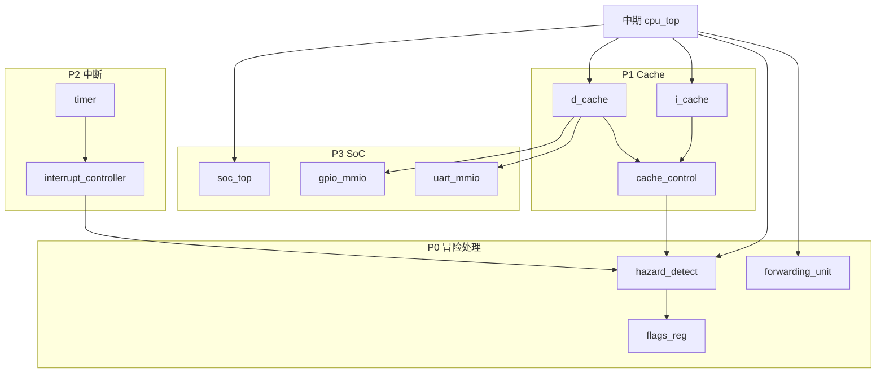

# 最终任务计划 · 完整五级流水 CPU + Cache + 中断 + SoC

> **依据**：最终稿数据流图（含 i_cache、d_cache、Cache_control、Hazard Detect、Forwarding、Stack/call/ret、Flags czvs）  
> **前置条件**：中期任务计划（`doc/0/中期任务计划.md`）已完成五级流水最小闭环  
> **最终目标**：实现数据流图全部功能，斐波那契验证通过，并完成 Cache 性能对比与 Timer 中断演示  
> **RTL 目录**：`rtl_pipe/` → `soc_top.vhd`

---

## 1. 最终范围总览

### 1.1 数据流图模块 → RTL 映射

| 数据流图模块 | RTL 文件 | 所属阶段 | 功能 |
|--------------|----------|----------|------|
| PC + PC_en | `if_stage.vhd` | IF | 受 hazard/cache 控制的 PC 更新 |
| Next-PC MUX | `if_stage.vhd` | IF | PC+1 / 分支目标 / Stack 返回地址 |
| **i_cache** | `i_cache.vhd` | IF | 指令 Cache，输出 Inst，上报 i_miss |
| IF/ID（IF_ID_en） | `pipe_if_id.vhd` | IF→ID | stall 时冻结；flush 时写 NOP |
| Control Unit | `control_unit.vhd` | ID | 硬布线译码，扩展 J/CALL/RET/SYS |
| Registers | `reg_file.vhd` | ID/WB | RS_addr/RD_addr 读，Wr_addr 写 |
| Unsigned Extend | `id_stage.vhd` | ID | 6 位 imm 零/符号扩展 |
| **Stack for call/ret** | `call_stack.vhd` | ID/IF | 硬件栈保存/弹出返回地址 |
| **Hazard Detect Unit** | `hazard_detect.vhd` | ID（全局） | stall / flush / PC 源选择 |
| ID/EX | `pipe_id_ex.vhd` | ID→EX | Control_src=0 时插 bubble |
| Forward MUX A/B | `ex_stage.vhd` | EX | 00=ID/EX，01=EX/MEM，10=MEM/WB |
| **Forwarding Unit** | `forwarding_unit.vhd` | EX | 输出 ForwardA / ForwardB |
| ALU + **Flags czvs** | `alu.vhd` + `flags_reg.vhd` | EX | C/Z/V/S 标志寄存器 |
| SP | `ex_stage.vhd` | EX | 栈指针维护（可选，与 call_stack 配合） |
| EX/MEM | `pipe_ex_mem.vhd` | EX→MEM | 锁存 alu_result、branch 信息 |
| **d_cache** | `d_cache.vhd` | MEM | Load/Store，上报 d_miss |
| MEM/WB | `pipe_mem_wb.vhd` | MEM→WB | 锁存 mem_data / alu_result |
| WB MUX（MemToReg） | `wb_stage.vhd` | WB | 选 load 数据或 ALU 结果 |
| **Cache_control** | `cache_control.vhd` | 全局 | 协调 i_miss/d_miss，发全局 stall |

### 1.2 最终验收标准

| 编号 | 验收项 | 预期结果 | 对应数据流图 |
|------|--------|----------|--------------|
| F1 | RAW 数据转发 | ForwardA/B 波形可见，无多余 stall | Forwarding Unit |
| F2 | load-use stall | LD 后接使用者 stall 1 拍 | Hazard Detect |
| F3 | 分支/跳转 flush | J/BNE 误取指被 NOP 冲刷 | Hazard Detect + Pc_src |
| F4 | 条件跳转 | JNZ/JZ 等依赖 czvs 正确跳转 | Flags + Hazard Detect |
| F5 | I-Cache miss stall | i_miss 时 PC/IF_ID 冻结 | Cache_control |
| F6 | D-Cache hit/miss | 统计 hit_rate，miss 时流水线冻结 | d_cache + Cache_control |
| F7 | CALL/RET | 子程序调用返回地址正确 | Stack for call/ret |
| F8 | 斐波那契正确性 | f7=13，Mem[13..17] 正确 | 全通路联调 |
| F9 | Timer 中断 | EPC/STATUS/IRET，ISR 执行后返回 | soc_top |
| F10 | MMIO 输出 | UART/GPIO 写入波形可见 | soc_top |

---

## 2. 完整数据通路（终稿）

```text
                         Cache_control ◄──── i_miss (i_cache)
                              │  ▲                d_miss (d_cache)
                              │  │ stall
                              ▼  │
  ┌── PC ◄── Next-PC MUX ◄── Stack ─────────────────────────────────────┐
  │     │      ▲ PC+1 / branch / ret                                     │
  │     ▼      │                                                         │
  │  i_cache ──┼──► IF/ID ──► Control ──► ID/EX ──► ALU ◄── Forward ──┤
  │            │       │        │    ▲       │         ▲      Unit     │
  │            │       │     reg_file│       │      Flags czvs         │
  │            │       │        │    │       │         │               │
  │            └── Hazard Detect ┘    │       ▼         ▼               │
  │                    │              │    EX/MEM ──► d_cache ──► MEM/WB│
  │                    └─────────────┴──────────────────────► WB MUX ──┘
  └──────────────────────────────────────────────────────► reg_file 写回
```

---

## 3. 任务分解（按优先级）

### 阶段 1：冒险处理（P0，第 1 周）

> **目标**：在中期 CPU 上叠加 Forwarding + Hazard Detect，原始斐波那契汇编无需改动能跑通。

#### 1.1 Forwarding Unit

| 序号 | 任务 | 细节 | 验收 |
|------|------|------|------|
| 1.1.1 | 实现 `forwarding_unit.vhd` | 输入 ID/EX.rs1/rs2、EX/MEM.rd、MEM/WB.rd 及 RegWrite | — |
| 1.1.2 | ForwardA/B 真值表 | EX/MEM 优先；EX/MEM.MemRead=1 时不从 EX/MEM 转发 | 见初期报告 6.1 节 |
| 1.1.3 | EX 阶段 Forward MUX | 00=ID/EX，01=EX/MEM.alu_result，10=MEM/WB.write_data | ADD→ADDI RAW 0 stall |

**ForwardA 优先级：**

```text
if EX/MEM.RegWrite and EX/MEM.rd=rs1 and EX/MEM.rd≠0 and not EX/MEM.MemRead:
    ForwardA = 01
elsif MEM/WB.RegWrite and MEM/WB.rd=rs1 and MEM/WB.rd≠0:
    ForwardA = 10
else:
    ForwardA = 00
```

#### 1.2 Hazard Detect Unit

| 序号 | 任务 | 细节 | 验收 |
|------|------|------|------|
| 1.2.1 | load-use 检测 | MemRead=1 且 ID/EX.rd = IF/ID.rs1 或 IF/ID.rd | LD+ADDI stall 1 拍 |
| 1.2.2 | stall 输出 | Pc_en=0, Ifid_en=0, Control_src=0 | EX 级插入 bubble |
| 1.2.3 | BNE flush（EX 级） | branch_taken → Ifid_src=1, Control_src=0, Pc←target | 循环正确 |
| 1.2.4 | J 跳转 flush（ID 级） | Control.Jump=1 → Pc_src=1, Ifid_src=1 | 见 `doc/6/跳转指令2.md` |
| 1.2.5 | 条件跳转 | Control.Jump=1 且 czvs 满足 → 同 J | JNZ/JZ 测试 |

**Hazard 输出信号约定：**

| 信号 | 含义 |
|------|------|
| `Pc_en = 0` | 冻结 PC（stall） |
| `Ifid_en = 0` | 冻结 IF/ID |
| `Ifid_src = 1` | IF/ID ← NOP（flush 误取指） |
| `Control_src = 0` | ID/EX ← bubble（控制全 0） |
| `Pc_src = 0/1/2` | PC+1 / ID 跳转目标 / EX 分支目标 |

#### 1.3 Flags（czvs）

| 序号 | 任务 | 细节 | 验收 |
|------|------|------|------|
| 1.3.1 | ALU 扩展 | 输出 Carry、Zero、Overflow、Sign | ADD/SUB 标志正确 |
| 1.3.2 | 标志寄存器 | EX 阶段写入，Hazard/Control 可读 | 条件跳转使用 czvs |
| 1.3.3 | 控制单元扩展 | 增加 JNZ/JZ/JC 等 opcode | 条件分支测试通过 |

---

### 阶段 2：Cache 系统（P1，第 2 周）

> **目标**：实现 i_cache + d_cache + Cache_control，miss 时全局 stall，并采集命中率。

#### 2.1 D-Cache

| 序号 | 任务 | 细节 | 验收 |
|------|------|------|------|
| 2.1.1 | 直接映射结构 | 16 行 × 4 word/行，16 bit 数据 | 见初期报告 7.2～7.4 节 |
| 2.1.2 | 地址划分 | tag(10) \| index(4) \| offset(2) | 寻址仿真正确 |
| 2.1.3 | 读命中/读缺失 refill | miss 时从 main_memory 读 4 word | d_miss 脉冲可见 |
| 2.1.4 | 写直达 | 写命中更 Cache+主存；写缺失直写主存 | ST 后主存数据正确 |
| 2.1.5 | cpu_ready 握手 | ready=0 时 MEM 级等待 | 波形 stall 可见 |
| 2.1.6 | 性能计数器 | hit_count、miss_count、hit_rate | 仿真结束后可读取 |
| 2.1.7 | MMIO 旁路 | 地址 0xFFxx 绕过 D-Cache | UART 访问不被 Cache |

#### 2.2 I-Cache

| 序号 | 任务 | 细节 | 验收 |
|------|------|------|------|
| 2.2.1 | 结构与 D-Cache 对称 | 仅只读，PC 寻址，输出 Inst | IF 阶段接入 |
| 2.2.2 | i_miss 处理 | miss 时 IF 停顿，refill 后继续取指 | i_miss 波形可见 |
| 2.2.3 | 替换 IF 级 instr_mem | i_cache 成为 IF 唯一指令来源 | 斐波那契仍正确 |

#### 2.3 Cache_control

| 序号 | 任务 | 细节 | 验收 |
|------|------|------|------|
| 2.3.1 | 汇总 i_miss / d_miss | 任一 miss 时 stall=1 | 全局 Pc_en/Ifid_en 等拉低 |
| 2.3.2 | 与 Hazard Detect 优先级 | hazard stall 与 cache stall 逻辑 OR | 两种 stall 不冲突 |
| 2.3.3 | refill 完成恢复 | miss 结束 → stall=0，流水线继续 | 无丢指令 |

**Cache miss 冻结规则：**

```text
if (i_miss or d_miss):
    Pc_en       = 0
    Ifid_en     = 0
    Idex_en     = 0   -- 可选：全流水线冻结
    Exmem_en    = 0
    Memwb_en    = 0
```

---

### 阶段 3：CALL/RET 与栈（P1 扩展，第 2 周并行）

| 序号 | 任务 | 细节 | 验收 |
|------|------|------|------|
| 3.1 | 硬件 call_stack | push: PC+1 入栈；pop → Next-PC MUX | CALL 后 PC 跳转，RET 返回 |
| 3.2 | Next-PC MUX 扩展 | 3 选 1：PC+1 / branch / stack_top | 与 Hazard Pc_src 配合 |
| 3.3 | 控制信号 | CALL opcode push；RET opcode pop | 小型子程序测试 |
| 3.4 | SP 维护（可选） | EX 级 SP±1 | 与数据栈分离，仅 call 栈 |

---

### 阶段 4：中断与 SoC（P2～P3，第 3 周）

#### 4.1 Timer 中断

| 序号 | 任务 | 产出 | 验收 |
|------|------|------|------|
| 4.1.1 | Timer 模块 | `timer.vhd` | 计数溢出产生 irq |
| 4.1.2 | 中断控制器 | `interrupt_controller.vhd` | irq_pending、优先级 |
| 4.1.3 | CSR 寄存器 | EPC、STATUS.IE、CAUSE | 中断时保存/恢复 |
| 4.1.4 | 精确中断 | MEM/WB 提交边界响应 + 全流水线 flush | 不破坏寄存器状态 |
| 4.1.5 | SYS 指令 | EI / DI / IRET | ISR 可返回主程序 |

**中断响应流程：**

```text
if irq_pending and STATUS.IE and instruction_commit:
    EPC       ← next_pc
    STATUS.IE ← 0
    PC        ← ISR_ADDR (0x0100)
    flush all pipeline stages
```

#### 4.2 MMIO 外设

| 序号 | 任务 | 产出 | 验收 |
|------|------|------|------|
| 4.2.1 | 地址译码 | `addr_decoder.vhd` | 0x0000～0xFEFF→RAM/Cache；0xFFxx→外设 |
| 4.2.2 | UART MMIO | `uart_mmio.vhd` | ST x3, UART(x0) 波形可见 |
| 4.2.3 | GPIO LED | `gpio_mmio.vhd` | 写 0xFF10 点亮 LED |
| 4.2.4 | SoC 顶层 | `soc_top.vhd` | CPU + Cache + Timer + MMIO 互联 |

#### 4.3 中断演示程序

```asm
; 主程序（0x0000）
ADDI x1, x0, 1
; ... 斐波那契主体 ...
EI                        ; 使能中断
HALT

; Timer ISR（0x0100）
ADDI x6, x6, 1            ; irq_count++
ST   x6, 0(x0)            ; MMIO → UART_DATA
IRET
```

---

### 阶段 5：系统集成与性能分析（P4，第 4 周）

#### 5.1 联调测试矩阵

| 测试编号 | 测试内容 | 验证点 |
|----------|----------|--------|
| FT1 | 斐波那契 + 全 hazard | F1～F3、F8 |
| FT2 | I/D Cache miss 注入 | F5、F6 |
| FT3 | CALL/RET 子程序 | F7 |
| FT4 | 条件跳转 czvs | F4 |
| FT5 | Timer 中断 + 斐波那契并行 | F9，主程序结果仍正确 |
| FT6 | UART 输出 f7=13 | F10 |

#### 5.2 性能数据采集

| 指标 | 采集方式 | 报告用途 |
|------|----------|----------|
| 总周期数 | testbench 计数 | CPI 计算 |
| stall 周期 | hazard stall + cache stall 分类计数 | 时空图标注 |
| flush 周期 | 分支/跳转 flush 计数 | 控制冒险代价 |
| cache_hit / cache_miss | d_cache 内部计数器 | 命中率 |
| hit_rate | hit / (hit + miss) | Cache 效果 |
| 加速比 | 无 Cache 周期 / 有 Cache 周期 | 性能对比表 |

**性能对比表（仿真后填实测值）：**

| 测试程序 | 无 Cache 周期 | 有 Cache 周期 | Hit rate | CPI | 加速比 |
|----------|:-------------:|:-------------:|:--------:|:---:|:------:|
| Fibonacci | | | | | |
| 顺序访问 | | | | | |
| 冲突访问 | | | | | |

#### 5.3 波形与时空图

| 交付 | 内容 |
|------|------|
| 五级流水时空图 | 含 RAW 转发、load-use stall、BNE flush 标注 |
| Cache miss 波形 | i_miss/d_miss + stall 对齐 |
| 中断响应波形 | irq → EPC → PC=0x0100 → IRET → 恢复 |
| Forward 波形 | ForwardA/B 非 00 的时刻 |

---

## 4. 最终 RTL 目录结构

```text
rtl_pipe/
  cpu_top.vhd
  if_stage.vhd
  id_stage.vhd
  ex_stage.vhd
  mem_stage.vhd
  wb_stage.vhd
  pipe_if_id.vhd
  pipe_id_ex.vhd
  pipe_ex_mem.vhd
  pipe_mem_wb.vhd
  reg_file.vhd
  alu.vhd
  flags_reg.vhd
  control_unit.vhd
  hazard_detect.vhd        # 终稿 Hazard Detect Unit
  forwarding_unit.vhd      # 终稿 Forwarding Unit
  i_cache.vhd
  d_cache.vhd
  cache_control.vhd        # 终稿 Cache_control
  call_stack.vhd           # Stack for call/ret
  main_memory.vhd
  soc_top.vhd
  interrupt_controller.vhd
  timer.vhd
  uart_mmio.vhd
  gpio_mmio.vhd
  sim/
    tb_cpu_final.vhd
    tb_soc.vhd
    prog/
      fibonacci.hex
      fibonacci_irq.hex
```

---

## 5. 模块依赖关系



**建议实现顺序：**

```text
Forwarding → Hazard Detect → Flags
    → d_cache → i_cache → Cache_control
    → call_stack
    → Timer/IRQ → MMIO → soc_top
    → 性能测试 → 最终报告
```

---

## 6. 里程碑时间表（建议 4 周）

| 周次 | 阶段 | 关键交付 | 验收 |
|------|------|----------|------|
| 第 1 周 | 阶段 1 | forwarding + hazard + flags | 斐波那契原始汇编正确，F1～F4 |
| 第 2 周 | 阶段 2～3 | i/d cache + cache_control + call/ret | F5～F7，命中率可统计 |
| 第 3 周 | 阶段 4 | Timer 中断 + UART/GPIO SoC | F9～F10 |
| 第 4 周 | 阶段 5 | 性能表、时空图、最终报告、答辩 | 全部 F1～F10 |

### 第 1 周日计划

| 天 | 任务 |
|----|------|
| D1 | forwarding_unit + EX 级 Forward MUX |
| D2 | load-use stall |
| D3 | BNE flush + J 跳转 flush |
| D4 | flags czvs + 条件跳转 |
| D5 | 斐波那契全 hazard 联调 |

### 第 2 周日计划

| 天 | 任务 |
|----|------|
| D1–D2 | d_cache 结构与 hit/miss |
| D3 | i_cache + 替换 IF 取指路径 |
| D4 | cache_control 全局 stall |
| D5 | call_stack + 性能计数器 |

---

## 7. 风险与裁剪方案

| 风险 | 影响 | 应对 |
|------|------|------|
| Cache refill 时序复杂 | miss stall 不正确 | 先固定 refill=4 周期，再优化 FSM |
| Hazard 与 Cache stall 冲突 | 丢指令/重复执行 | 统一 stall 逻辑 OR，单点控制 Pc_en |
| 中断破坏流水线状态 | 寄存器/内存错误 | 严格 MEM/WB 边界响应 + 全 flush |
| I-Cache 时间不够 | 进度延误 | 保留直连主存模式，报告说明为扩展 |
| CALL/RET 非必需 | 范围蔓延 | 时间紧则仅文档描述，不做 RTL |

**时间不足时的裁剪优先级：**

```text
必做：Forwarding + Hazard + d_cache + 斐波那契 + 性能表
建议：i_cache + Timer 中断波形
可选：call_stack、GPIO、复杂测试集
```

---

## 8. 最终交付清单

### 8.1 代码与仿真

- [ ] `rtl_pipe/` 完整 VHDL 源码（与数据流图模块一一对应）
- [ ] ModelSim/Quartus 仿真工程
- [ ] 测试程序：`fibonacci.hex`、`fibonacci_irq.hex`
- [ ] 仿真波形截图（hazard、cache、interrupt 各至少 1 组）

### 8.2 报告内容

- [ ] 最终报告：架构设计、数据流图对照、指令系统
- [ ] 冒险处理：转发真值表、load-use/BNE/J flush 时空图
- [ ] Cache 设计：地址划分、FSM、命中率与 CPI 对比表
- [ ] 中断设计：EPC/STATUS/IRET 流程、ISR 时序图
- [ ] 与旧多周期 CPU 对比：吞吐率、CPI、扩展性

### 8.3 答辩要点

> 本课设从多周期模型机出发，按最终数据流图实现了五级流水 CPU 的全部关键机制：段间流水线寄存器、Forwarding/Hazard Detect 冒险处理、I/D Cache 与 Cache_control 协同 stall、czvs 条件跳转、CALL/RET 硬件栈，以及 Timer 精确中断与 MMIO 最小 SoC；以斐波那契程序统一验证功能，以 Cache 命中率与 CPI 量化性能收益。

---

## 9. 参考文档索引

| 文档 | 路径 | 用途 |
|------|------|------|
| 初期报告 | `doc/0/流水线CPU-Cache-中断-嵌入式课设-初期报告.md` | 指令编码、Cache 参数、中断规格 |
| 中期任务 | `doc/0/中期任务计划.md` | 前置里程碑 |
| 数据转发 | `doc/3/Forward*.md` | Forwarding Unit 设计 |
| Hazard Detect | `doc/4/HazardDetect*.md` | stall/flush 信号约定 |
| 跳转指令 | `doc/6/跳转指令2.md` | ID 级 J/条件跳转 |
| I-Cache 说明 | `doc/1/i_cache.md` | IF 阶段取指 |
| 五级流水数据通路 | `doc/1/五级流水数据通路.md` | 旧→新对照 |
