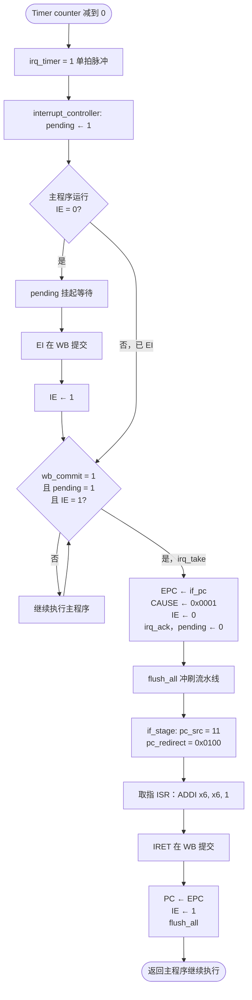

# Timer 精确中断实现说明

> 对应中期报告 §8～§9；RTL 目录 `cpu_pipe/rtl/`  
> 验收项 **V8**：Timer 中断 — PC 跳转 ISR，`IRET` 返回

---

## 1. 总体数据通路

Timer 溢出 → `irq_pending` → `cpu_top` 在 WB 边界响应 → 保存 EPC、跳转 ISR → ISR 执行 `IRET` 返回。

```text
timer.vhd                interrupt_controller.vhd          cpu_top.vhd
  irq_timer ───────────► irq_timer ──► pending ──► irq_pending
                                                    │
  MMIO 0xFF20/FF24 ◄── soc_top ◄── MEM 级 ST/LD      │
                                                    ▼
                              wb_commit / irq_take / flush_all
                                                    │
                              if_stage: pc_src=11 ──┘
```

**SoC 互联**（`soc_top.vhd`）：Timer 的 `irq_timer` 接入 `cpu_top.irq_timer`；MMIO 地址 `0xFFxx` 旁路（绕过）D-Cache。

```220:257:cpu_pipe/rtl/soc_top.vhd
  is_mmio <= '1' when mem_addr(15 downto 8) = x"FF" else '0';

  dc_addr      <= mem_addr;
  dc_wdata     <= mem_wdata;
  dc_read_en   <= mem_read_en when is_mmio = '0' else '0';
  dc_write_en  <= mem_write_en when is_mmio = '0' else '0';
  mem_rdata    <= mmio_rdata when is_mmio = '1' else dc_rdata;
  ...
      irq_timer         => irq_timer,
```

is_mmio, 标志信号，表示 CPU 这次访存地址是不是 MMIO 外设区（0xFF00～0xFFFF）。

---

## 2. 关键常量（cpu_top）

```42:43:cpu_pipe/rtl/cpu_top.vhd
  constant ISR_ADDR : std_logic_vector(ADDR_WIDTH - 1 downto 0) := x"0100";
  constant CAUSE_TIMER : std_logic_vector(ADDR_WIDTH - 1 downto 0) := x"0001";
```

| 常量 | 值 | 用途 |
|------|-----|------|
| `ISR_ADDR` | `0x0100` | 中断服务程序入口 |
| `CAUSE_TIMER` | `0x0001` | 响应 Timer 中断时写入 CAUSE bit0 |

---

## 3. interrupt_controller.vhd — CSR 与 pending

### 3.1 端口

```11:33:cpu_pipe/rtl/interrupt_controller.vhd
  port (
    clk   : in  std_logic;
    rst   : in  std_logic;
    irq_timer : in std_logic;
    epc_out   : out std_logic_vector(ADDR_WIDTH - 1 downto 0);
    status_ie : out std_logic;
    cause_out   : out std_logic_vector(ADDR_WIDTH - 1 downto 0);
    epc_write   : in  std_logic;
    epc_wdata   : in  std_logic_vector(ADDR_WIDTH - 1 downto 0);
    ie_set      : in  std_logic;
    ie_clear    : in  std_logic;
    cause_write : in  std_logic;
    cause_wdata : in  std_logic_vector(ADDR_WIDTH - 1 downto 0);
    irq_ack     : in  std_logic;
    irq_pending : out std_logic
  );
```

### 3.2 寄存器行为

| 寄存器 | 实现 | 说明 |
|--------|------|------|
| EPC | `epc_reg` | `epc_write=1` 时锁存 `epc_wdata` |
| STATUS.IE | `status_reg(0)` | `ie_set` 置 1；`ie_clear` 清 0（set 优先） |
| CAUSE | `cause_reg` | `cause_write=1` 时锁存 |
| pending | `pending` | `irq_timer=1` 置位；`irq_ack=1` 清除 |

```54:76:cpu_pipe/rtl/interrupt_controller.vhd
    elsif rising_edge(clk) then
      if irq_timer = '1' then
        pending <= '1';
      end if;

      if irq_ack = '1' then
        pending <= '0';
      end if;

      if epc_write = '1' then
        epc_reg <= epc_wdata;
      end if;
      ...
      if ie_set = '1' then
        status_reg(0) <= '1';
      elsif ie_clear = '1' then
        status_reg(0) <= '0';
      end if;
```

**注意**：`irq_timer` 为单周期脉冲；pending 会保持为 1，直到 CPU 发出 `irq_ack`（即 `irq_take`）。

---

## 4. timer.vhd — 中断源

### 4.1 地址常量（ADDR_CTRL / ADDR_PERIOD）

用于 MMIO **地址译码**：CPU `ST`/`LD` 时根据 `addr` 选中对应寄存器。

```28:29:cpu_pipe/rtl/timer.vhd
  constant ADDR_CTRL   : std_logic_vector(15 downto 0) := x"FF20";
  constant ADDR_PERIOD : std_logic_vector(15 downto 0) := x"FF24";
```

| 地址 | 常量 | 读 | 写 |
|------|------|----|----|
| `0xFF20` | `ADDR_CTRL` | bit0 = `ctrl_en`，其余位 = 0 | 见下方 **本课设位定义** |
| `0xFF24` | `ADDR_PERIOD` | 当前 `period_reg`（16 位） | 整 16 位 `wdata` 为周期 |

CPU 执行 **`LD`** 读 Timer 时，外设经 `rdata` 返回上表读列的值（与中断无关，需软件主动读）。

> **本课设规定**（`timer.vhd` 自行定义，非 CPU 指令集统一标准）：写 **`0xFF20`** 时  
> - **`0xFF20(0)`**（`wdata(0)`）：Timer 使能，`1`=开始倒计时，`0`=停止。  
> - **`0xFF20(1)`**（`wdata(1)`）：写 `1` 时清除溢出脉冲并将 `counter` 重载为 `period_reg`。  

### 4.2 MMIO 写数据 wdata

`wdata` 是 **`ST` 指令写入的 16 位数据**（CPU 侧为 `mem_wdata`）。**仅在外设被写时**才更新寄存器，不参与每拍倒计时。

```48:58:cpu_pipe/rtl/timer.vhd
      if sel = '1' and write_en = '1' then
        if addr = ADDR_CTRL then
          ctrl_en <= wdata(0);
          if wdata(1) = '1' then
            irq_pulse <= '0';
            counter   <= period_reg;
          end if;
        elsif addr = ADDR_PERIOD then
          period_reg <= unsigned(wdata);
          counter    <= unsigned(wdata);
        end if;
      end if;
```

### 4.3 MMIO 读数据 rdata

CPU **`LD`** 读 Timer 且 `sel=1`、`read_en=1` 时，`rdata` 组合逻辑返回：

| 地址 | `rdata` |
|------|---------|
| `0xFF20` | bit0 = `ctrl_en`，bit15..1 = 0（使能时为 `0x0001`） |
| `0xFF24` | 当前 `period_reg`（如 80 → `0x0050`） |
| 其他 | `0x0000` |

```72:76:cpu_pipe/rtl/timer.vhd
  rdata <= (0 => ctrl_en, others => '0')
           when sel = '1' and read_en = '1' and addr = ADDR_CTRL else
           std_logic_vector(period_reg)
           when sel = '1' and read_en = '1' and addr = ADDR_PERIOD else
           (others => '0');
```

### 4.4 内部信号：ctrl_en / irq_pulse / irq_timer

| 信号 | 作用 |
|------|------|
| `ctrl_en` | Timer 使能；1 时 `counter` 每拍减 1 |
| `irq_pulse` | 内部溢出脉冲；`counter=0` 时单周期为 1 |
| `irq_timer` | 输出端口，`irq_timer <= irq_pulse`，接中断控制器 |

### 4.5 period_reg 与 counter（默认周期 80）

| 寄存器 | 作用 |
|--------|------|
| `period_reg` | 保存溢出周期；复位 = `DEFAULT_PERIOD`（80） |
| `counter` | 当前倒计时；复位 = 80；减到 0 后从 **`period_reg`** 重载 |

**正常运行不读 `wdata`**，只用 `counter` 递减 + `period_reg` 重载。只有 CPU 写 `0xFF24` 时才用 `wdata` 改周期。

### 4.6 默认配置（复位）

复位后自动使能，周期 80 拍，便于仿真观察：

```40:44:cpu_pipe/rtl/timer.vhd
    if rst = '0' then
      ctrl_en    <= '1';
      period_reg <= to_unsigned(DEFAULT_PERIOD, 16);
      counter    <= to_unsigned(DEFAULT_PERIOD, 16);
      irq_pulse  <= '0';
```

### 4.7 溢出逻辑

```61:68:cpu_pipe/rtl/timer.vhd
      if ctrl_en = '1' then
        if counter = 0 then
          irq_pulse <= '1';
          counter   <= period_reg;
        else
          counter <= counter - 1;
        end if;
      end if;
```

`irq_timer` 即 `irq_pulse`，每 `PERIOD` 个时钟产生一个周期的脉冲。

---

## 5. SYS 指令译码（id_stage）

OpCode `1110`，子操作由 `instruction(2 downto 0)`（即 I 型 imm 低 3 位 / `funct3`）决定：

```204:210:cpu_pipe/rtl/id_stage.vhd
      when "1110" => -- SYS: EI / DI / IRET
        case funct3 is
          when "000" => sys_ei   <= '1';
          when "001" => sys_di   <= '1';
          when "010" => sys_iret <= '1';
          when others => null;
        end case;
```

| 指令 | imm[2:0] | 机器码 | 产生的信号 |
|------|----------|--------|------------|
| EI | `000` | `E000` | `sys_ei` |
| DI | `001` | `E001` | `sys_di` |
| IRET | `010` | `E002` | `sys_iret` |

SYS 信号与 `valid` 位一起经 **ID/EX → EX/MEM → MEM/WB** 流水传递，在 WB 级提交时生效（不写通用寄存器）。

---

## 6. cpu_top — 精确中断核心逻辑

### 6.1 实例化 interrupt_controller

```596:613:cpu_pipe/rtl/cpu_top.vhd
  u_irq : interrupt_controller
    generic map (ADDR_WIDTH => ADDR_WIDTH)
    port map (
      clk         => clk,
      rst         => rst,
      irq_timer   => irq_timer,
      epc_out     => epc_reg,
      status_ie   => status_ie,
      ...
      irq_ack     => irq_ack,
      irq_pending => irq_pending
    );
```

### 6.2 响应条件（组合逻辑）

```615:618:cpu_pipe/rtl/cpu_top.vhd
  wb_commit <= mem_wb_valid when cache_stall = '0' else '0';
  iret_commit <= mem_wb_valid and mem_wb_sys_iret and cache_stall = '0';
  irq_take <= irq_pending and status_ie and wb_commit and cache_stall = '0' and mem_wb_sys_iret = '0';
  flush_all <= irq_take or iret_commit;
```

| 信号 | 含义 |
|------|------|
| `mem_wb_valid` | WB 级有真实指令（非 bubble）；随 `id_ex_valid → ex_mem_valid → mem_wb_valid` 传递 |
| `wb_commit` | 指令提交边界；`cache_stall=1` 时不提交、不响应中断 |
| `irq_take` | 本拍进入 ISR：`pending ∧ IE ∧ wb_commit`，且 WB 不是 IRET |
| `iret_commit` | WB 级 IRET 提交，触发返回 |
| `flush_all` | 中断进入或 IRET 返回时冲刷流水线 |

### 6.3 中断响应时 CPU 侧动作

```620:639:cpu_pipe/rtl/cpu_top.vhd
  pc_redirect <= epc_reg when iret_commit = '1' else ISR_ADDR;
  pc_src <= "11" when flush_all = '1' else
            "10" when id_ex_jump = '1' else hz_pc_src;
  ...
  epc_write   <= '1' when irq_take = '1' else '0';
  epc_wdata   <= if_pc;
  ie_set      <= '1' when iret_commit = '1' or (mem_wb_valid and mem_wb_sys_ei and cache_stall = '0') else '0';
  ie_clear    <= '1' when irq_take = '1' or (mem_wb_valid and mem_wb_sys_di and cache_stall = '0') else '0';
  cause_write <= '1' when irq_take = '1' else '0';
  cause_wdata <= CAUSE_TIMER;
  irq_ack     <= irq_take;
```

**中断进入（`irq_take=1`）**：

1. `EPC ← if_pc`（IF 级 PC，即将被 flush 的下一条指令地址）
2. `STATUS.IE ← 0`
3. `CAUSE ← 0x0001`
4. `PC ← ISR_ADDR`（`pc_src=11`，`pc_redirect=0x0100`）
5. `irq_ack` 清除 pending
6. `flush_all` 冲刷各级流水

**IRET 返回（`iret_commit=1`）**：

1. `PC ← EPC`（`pc_redirect=epc_reg`）
2. `STATUS.IE ← 1`
3. `flush_all` 冲刷误取指

**EI / DI（WB 提交）**：

- `sys_ei` → `ie_set`
- `sys_di` → `ie_clear`

### 6.4 流水线 flush 实现

**IF/ID**：`ifid_src=1` 时指令 MUX 选 NOP（全 0）

```627:628:cpu_pipe/rtl/cpu_top.vhd
  ifid_src <= '1' when hz_ifid_src = '1' or id_ex_jump = '1' or flush_all = '1' else '0';
  control_src <= '0' when hz_control_src = '0' or flush_all = '1' else '1';
```

**ID/EX**：`control_src=0` 时插入 bubble（控制全 0，`id_ex_valid=0`）

**EX/MEM、MEM/WB**：`flush_all=1` 时清空有效位与控制（见 `ex_mem_reg` / `mem_wb_reg` 进程中 `if flush_all = '1'` 分支）

```758:769:cpu_pipe/rtl/cpu_top.vhd
        if flush_all = '1' then
          ex_mem_reg_write  <= '0';
          ...
          ex_mem_sys_iret   <= '0';
          ex_mem_valid      <= '0';
```

### 6.5 if_stage — PC 重定向

```44:48:cpu_pipe/rtl/if_stage.vhd
  with pc_src select
    pc_next <= unsigned(branch_target)  when "01",
               unsigned(jump_target)    when "10",
               unsigned(pc_redirect)    when "11",
               pc_plus1                 when others;
```

| `pc_src` | 来源 | 场景 |
|----------|------|------|
| `00` | PC+1 | 顺序执行 |
| `01` | `branch_target` | BNE 成立 |
| `10` | `jump_target` | J 跳转 |
| `11` | `pc_redirect` | 中断 → `0x0100`；IRET → EPC |

---

## 7. 时序：一次完整中断



```mermaid
sequenceDiagram
    participant T as timer
    participant IC as interrupt_controller
    participant CPU as cpu_top
    participant IF as if_stage
    T->>IC: irq_timer=1（单拍）
    IC->>IC: pending←1
    Note over CPU: 斐波那契运行，IE=0，pending 等待
    CPU->>IC: EI 在 WB 提交 → IE←1
    Note over CPU: wb_commit=1 且 pending=1
    CPU->>IC: EPC←if_pc; IE←0; irq_ack
    CPU->>IF: pc_src=11, pc_redirect=0x0100
    Note over IF: flush 流水，PC 取 ISR
    CPU->>CPU: ADDI x6,x6,1
    CPU->>IC: IRET → PC←EPC; IE←1; flush
```

---

## 8. 演示程序（main_memory.vhd）

### 8.1 主程序

斐波那契循环后开中断并停机：

```37:39:cpu_pipe/rtl/main_memory.vhd
    10 => x"4A3A", -- BNE  x5, x0, LOOP (offset = -6)
    11 => x"E000", -- EI
    12 => x"F000", -- HALT
```

执行顺序：`0x00`～`0x0A` 斐波那契 → `0x0B` EI（`STATUS.IE=1`）→ `0x0C` HALT（PC 冻结）。

### 8.2 ISR @ 0x0100

```41:43:cpu_pipe/rtl/main_memory.vhd
    -- Timer ISR @ 0x0100
    256 => x"0D81", -- ADDI x6, x6, 1
    257 => x"E002", -- IRET
```

| 地址 | 机器码 | 指令 | 说明 |
|------|--------|------|------|
| `0x0100` | `0D81` | `ADDI x6, x6, 1` | **x6**：中断计数器 `irq_cnt`，每进 ISR 加 1 |
| `0x0101` | `E002` | `IRET` | 返回主程序 |

**x6 的作用**：记录 Timer 中断发生次数。斐波那契占用 x1～x5，x6 专供 ISR 使用，修改 x6 不破坏主程序寄存器与内存结果。验收时在波形中观察 `u_id/regs(6)` 是否递增。

ISR 经 I-Cache 从 `main_memory` 取指（与指令区同一存储体，哈佛接口）。

### 8.3 可选：UART 基址常量

```40:40:cpu_pipe/rtl/main_memory.vhd
    31 => x"FF00", -- UART 基址常量（供 LD 预载 x7，可选）
```

扩展 ISR 写 UART 时，可在主程序用 `LD x7, 31(x0)` 预载 `0xFF00`，ISR 中 `ST x6, 0(x7)`。

---

## 9. MMIO 外设（已实现，ISR 可扩展）

| 地址 | 模块 | 文件 |
|------|------|------|
| `0xFF00` / `0xFF04` | UART | `uart_mmio.vhd` |
| `0xFF10` | GPIO LED | `gpio_mmio.vhd` |
| `0xFF20` / `0xFF24` | Timer | `timer.vhd` |

地址译码在 `soc_top.vhd` 第 233～237 行；读数据 MUX 在第 239～242 行。

---

## 10. 与 hazard / Cache 的优先级

```text
cache_stall = 1     → pc_en=0，wb_commit=0，不响应中断
flush_all           → 覆盖 hazard_unit 的 pc_src / ifid_src / control_src
id_ex_jump          → pc_src=10（次于 flush_all）
BNE                 → hazard_unit 输出 pc_src=01
```

Cache miss 期间 `cache_stall=1`，中断等待 refill 完成后再在 WB 边界响应，避免与 miss 冻结冲突。

---

## 11. 仿真验证

### 11.1 运行

```tcl
cd D:/code2/hardware/Structure/final/cpu_pipe/sim
do run.do
```

`run.do` 已包含中断相关 RTL 编译顺序及 8000 ns 仿真。

### 11.2 波形信号（与 run.do 一致）

| 信号 | 路径 |
|------|------|
| `debug_pc` / `debug_epc` | `tb_soc_top/` |
| `debug_irq_pending` / `debug_status_ie` | `tb_soc_top/` |
| `irq_timer` | `u_dut/u_timer/` |
| `irq_take` / `iret_commit` / `flush_all` | `u_dut/u_cpu/` |

### 11.3 预期现象

1. 斐波那契完成后 `EI`，`debug_status_ie=1`
2. Timer 溢出 → `debug_irq_pending=1`
3. `irq_take=1` 一拍 → `debug_pc` 变为 `0100`，`debug_epc` 保存返回地址
4. ISR 执行后 `iret_commit=1` → PC 回到 EPC 附近
5. 多次中断后寄存器 `x6` 递增（可在 `u_dut/u_cpu/u_id/regs(6)` 观察）

### 11.4 ISR / IRET 与 I-Cache 时序（约 935–1015ns）

- **935–945ns**：**ADDI** 在 WB，**IRET** 在 MEM
- **945–985ns**：ISR 预取 **miss** → `cache_stall` + refill；IRET **卡在 MEM**
- **995–1005ns**：**`iret_commit=1`**（IRET 在 WB 提交）；**≈1005ns** `PC←EPC`（`0x0D`）

详见 **[ISR-IRET与I-Cache时序.md](./ISR-IRET与I-Cache时序.md)**。

### 11.5 通过标准

- [ ] `Mem[13..17] = 2,3,5,8,13`（主程序结果不受破坏）
- [ ] 波形可见 `irq_pending` → `PC=0100` → `IRET` → PC 恢复
- [ ] `x6 > 0`

---

## 12. 代码文件索引

| 文件 | 职责 |
|------|------|
| `interrupt_controller.vhd` | CSR + irq_pending |
| `timer.vhd` | MMIO Timer → irq_timer |
| `uart_mmio.vhd` / `gpio_mmio.vhd` | MMIO 外设 |
| `cpu_top.vhd` | irq_take、flush、SYS 提交、u_irq 实例 |
| `id_stage.vhd` | SYS 译码 |
| `if_stage.vhd` | pc_src=11 |
| `soc_top.vhd` | MMIO 旁路、外设互联 |
| `main_memory.vhd` | 主程序 + ISR 机器码 |
| `sim/run.do` | 编译顺序与 IRQ 波形 |

---

## 13. 后续扩展

| 方向 | 代码改动点 |
|------|------------|
| ISR 写 UART | `main_memory` 预载 x7；ISR 加 `ST`；注意 load-use 若未实现需间隔指令 |
| 嵌套中断 | `interrupt_controller` 增加硬件栈；`irq_take` 时 push EPC |
| 多中断源 | 扩展 `cause_reg` 编码；`irq_pending` 改为向量优先级 |
