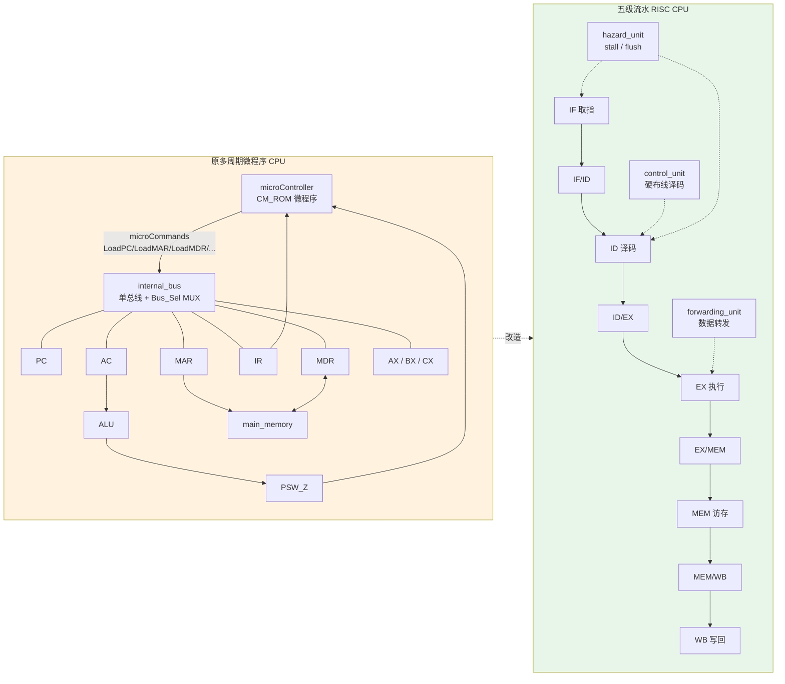
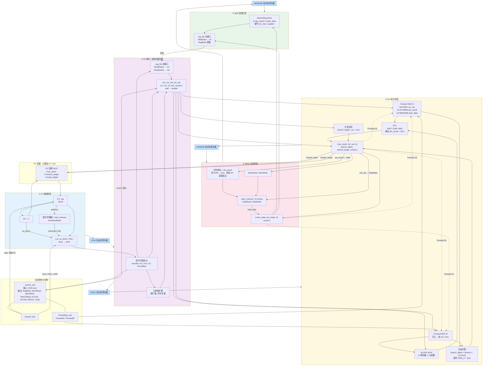
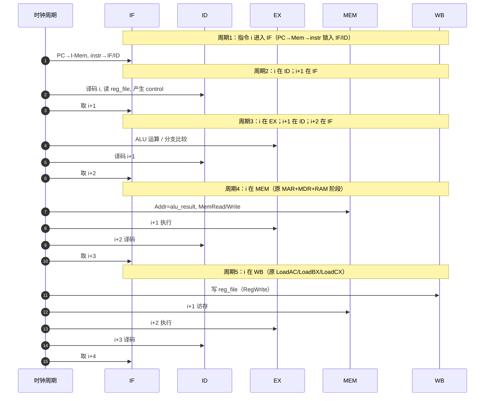
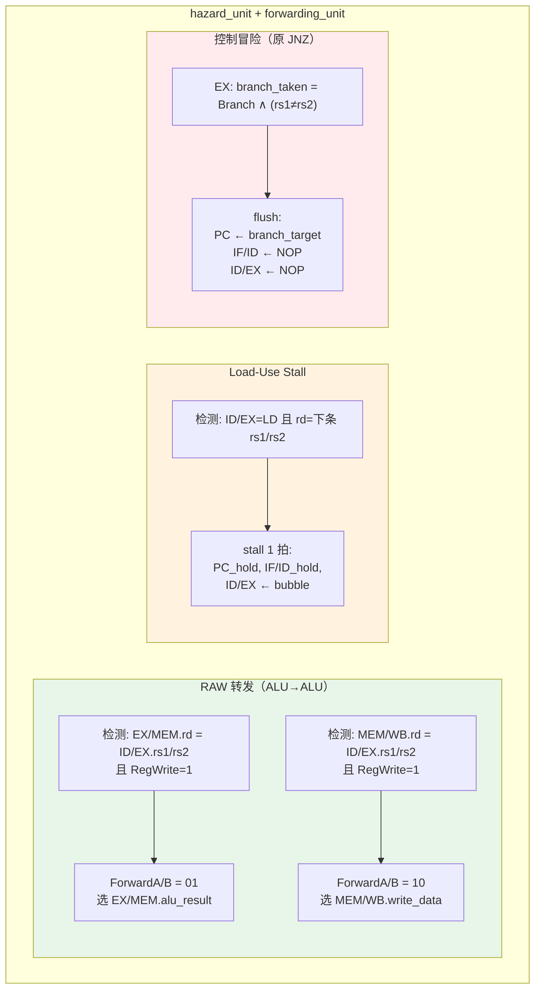
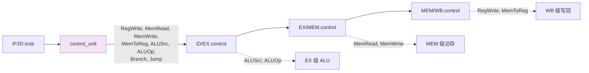
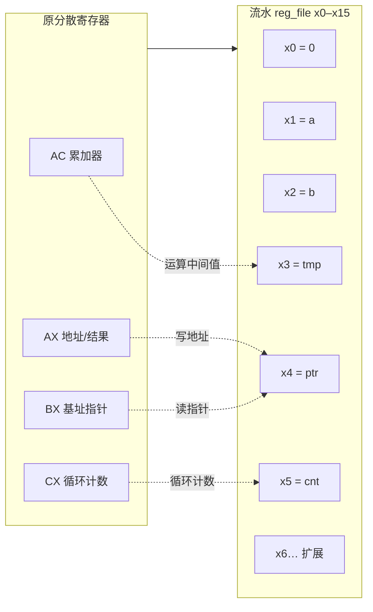

下面是根据你的**微程序控制单总线模型机**（PC/MAR/MDR/IR/AC/AX/BX/CX + ALU + PSW + RAM + `microController`）改造成的**五级流水数据通路**详细 Mermaid 示意图。核心思路是：**去掉单总线分时复用，改为段间专用通路 + 流水线寄存器 + 硬布线控制器**。

---

## 1. 总体架构：旧 → 新 映射

| 原组件 | 原作用 | 流水化后归属 |
|--------|--------|--------------|
| `PC_reg` + `LoadPC`/`IncPC` | 取指/跳转 | **IF** 级 PC；分支在 **EX** 更新 |
| `MAR` + `MemR` | 送地址读 RAM | **IF** 用 PC 读指令；**MEM** 用 ALU 结果访存 |
| `MDR` + `MDR_Sel` | 缓冲 RAM 数据 | **IF/ID.instr**；**MEM/WB.mem_data** |
| `IR_reg` + `LoadIR` | 锁存指令 | **IF/ID** 流水线寄存器 |
| `IR(15:12)` → Map | 微程序跳转 | **ID** 硬布线 `control_unit` |
| `IR_Operand_Ext` | 立即数扩展 | **ID** 立即数扩展器 |
| `AC` + `AC_Sel` + ALU | 运算 | **EX** ALU + **WB** 写回 |
| `AX/BX/CX` | 专用寄存器 | 统一 **reg_file**（x0–x15） |
| `PSW_Z` + `JNZ` | 条件分支 | **EX** 比较 + `BNE` |
| `internal_bus` + `Bus_Sel` | 分时传数 | **段间专用线 + Forward MUX** |
| `microController` | 微周期控制 | **control_unit + 控制信号流水传递** |

---

## 2. 五级流水数据通路（详细）

---

## 3. 原微周期 → 五级流水 时序对照

以原取指微序列 `PC→MAR→RAM→MDR→IR` 和 `MOVE AC,[BX]` 为例：

**对比原模型机**：原来一条指令要多个微周期串行占用总线；流水化后 5 个阶段**并行**，每拍各处理不同指令的不同阶段。

---

## 4. 冒险处理单元（必须加）

单总线模型机天然串行、无冒险；流水化后必须补这三块：

---

## 5. 控制信号流水传递（替代 microCommands）

原 32 位 `microCommands` 每位控制一个微操作；流水 CPU 改为**ID 一次译码，控制信号随流水线寄存器向后传**：

| 原微命令 | 流水化后等价 |
|----------|--------------|
| `LoadMAR` + `MemR` + `LoadMDR` + `LoadIR` | IF 级一次完成，结果进 **IF/ID** |
| `Bus_Sel` 选 IR/Operand | ID 级 **imm 扩展 + reg_file 读** |
| `LoadAC` + `ALU_op` + `AC_Sel←ALU` | EX 级 **ALU** + WB 级 **RegWrite** |
| `LoadAX/BX/CX`, `IncAX/IncBX/DecCX` | WB 级 **RegWrite**（ADDI/ADD 实现） |
| `MemW` + MDR→RAM | MEM 级 **MemWrite** |
| `LoadPC` + `PC_Sel` | IF 级 **PC+1**；EX 级 **branch_taken→PC** |
| `LoadPSW` + `JNZ` | EX 级 **BNE 比较**，不再单独 PSW 寄存器 |

---

## 6. 寄存器堆整合（AX/BX/CX/AC → reg_file）

---

## 设计要点小结

1. **单总线消失**：原 `Bus_Sel` 在 5 个时钟里选 PC/MDR/IR/AC…；流水 CPU 用**固定连线**，冲突靠 **Forwarding MUX** 解决。
2. **MAR/MDR 不再独立可见**：IF 级隐含“PC 即地址”；MEM 级 `alu_result` 即 MAR，`mem_data` 即原 MDR 读回值。
3. **微程序控制器退役**：`microController` → `control_unit`；微周期序列 → 固定 5 级 + 冒险处理。
4. **分支提前到 EX**：原 `JNZ` 在微程序末尾看 `PSW_Z`；流水 CPU 在 EX 比较 `rs1/rs2`，误取 2 条需 **flush**。
5. **Load-Use 必须 stall 1 拍**：原模型机 `MOVE AC,[BX]` 下一微步才能用 AC；流水里 LD 结果要到 MEM 末才就绪，EX 太早，转发解决不了。

如果你需要，我可以把上述 Mermaid **直接写入** `流水线CPU-Cache-中断-嵌入式课设-初期报告.md` 的 §5 章节，或再出一版**仅保留 IF/ID/EX/MEM/WB、适合 PPT 的精简图**。