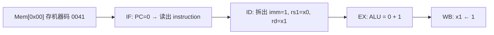

你的问题可以拆成三条线：**斐波那契数存在哪**、**imm 从哪来**、**instruction 从哪来**。下面按课设报告里的设计说明。

---

## 1. 斐波那契数（1, 1, 2, 3, 5…）还在内存里吗？

**一部分在内存，一部分在寄存器里算。**

和旧多周期模型机相比，流水版更强调**寄存器里滚动计算**，内存主要存**程序**和**写回的结果**。

| 内容 | 旧 CPU（`斐波那契数列计算模型机.md`） | 流水 CPU（初期报告 §4.6） |
|------|--------------------------------------|---------------------------|
| 初值 f₁、f₂ | 依赖 `Mem[11]=1`, `Mem[12]=1`，用 `MOVE AC,[BX]` 从内存读 | **`ADDI x1,x0,1` / `ADDI x2,x0,1`**，常数 **1 在指令的 imm 里**，不一定要先读 Mem[11/12] |
| 循环中的 a、b、tmp | 多在 AC、AX、BX 等寄存器 | 在 **x1、x2、x3** |
| 新项 2,3,5,8,13 | `STORE` 写到 `Mem[13]…` | **`ST x3, 0(x4)`** 写到 **`Mem[13..17]`** |

报告里的主存布局：

```text
0x00～0x0B：机器指令（程序）
Mem[11]=1, Mem[12]=1  ← testbench 可预置（可选，用于和旧版对照）
运行后 Mem[13..17] = 2, 3, 5, 8, 13
```

所以：

- **2, 3, 5, 8, 13**：仍在**数据区内存**里，由 `ST` 写入。
- **运行中的 1, 1 以及每次新的和**：主要在 **x1/x2/x3**，不是每拍都从内存读。
- **Mem[11]、Mem[12]**：流水主程序**可以不读**；预置只是为了验收或和旧机一致。

验收标准写的是：`x3 = 13`，`Mem[13..17] = 2,3,5,8,13`——重点在**写回内存的结果**，不是要求 1、1 必须从 Mem[11/12] 读出来。

---

## 2. imm 从哪里来？

**来自当前这条 16 位指令字本身，不是另一次访存。**

I 型格式（报告 §4.2）：

```text
| opcode(4) | rs1(3) | rd(3) | imm(6) |
```

例如 `ADDI x1, x0, 1` 的机器码 `0041` 里，**imm=+1** 就编在最低 6 位。

数据通路里（§5.1、§5.2）：

```text
IF  取出 instruction（整字 16 位）
    ↓ 锁入 IF/ID
ID  按 opcode 拆字段 → 取出 imm/offset → 符号/零扩展
    ↓ 锁入 ID/EX
EX  若 ALUSrc=1，MUX 选「立即数」而不是 rs2 进 ALU
```

`doc/1/5/寻址方式.md` 里写得很直接：**IMM = 指令自带的数字，不经过寄存器堆，也不为此单独访问内存。**

| 指令 | imm 的用途 |
|------|------------|
| `ADDI x1, x0, 1` | 常数 **1** → x1 |
| `ADDI x4, x0, 13` | 初值指针 **13** |
| `ADDI x5, x5, -1` | 常数 **-1** |
| `BNE …, loop` | 分支 **offset**（也是指令里的 6 位） |
| `ST x3, 0(x4)` | **offset=0**（S 型里的 offset 字段） |

---

## 3. instruction 从哪里来？也是 memory 吗？

**是。IF 阶段用 PC 当地址，从存储器读出整条指令。**

```text
PC ──地址──> 指令存储器 / main_memory（IF 读口）
                │
                └──> instruction（16 位）──> IF/ID ──> ID 译码（含拆 imm）
```

报告 §5.1：IF 的输入是 **PC、指令存储器**；输出是 **instruction、PC+1**。

和数据的区别：

| 项目 | 取指（IF） | 访存（MEM，如 ST） |
|------|------------|-------------------|
| 地址 | **PC**（0x00, 0x01, …） | **ALU 结果**（如 x4=13） |
| 读出/写入 | **指令字** | **数据**（如 2, 3, 5） |
| 典型地址 | 0x00～0x0B | 13～17 |

实现上可以：

- **冯·诺依曼**：指令和数据共用 `main_memory`（报告机器码表就是 0x00 起放指令）；
- **哈佛/双口**：逻辑上仍是「存储器」，只是 IF 走指令口、MEM 走数据口（§6.3 提到 IF 与 MEM 结构冒险时的处理）。

图里的 **`i_cache`**：仍是「按 PC 取指令」；课设**第一版可不实现 I-Cache**，IF 直接连主存或 `instr_mem`（见 `doc/1/i_cache.md`）。

---

## 4. 整条链路串起来（斐波那契一例）

以 `ADDI x1, x0, 1` 为例：



以 `ST x3, 0(x4)` 为例：


- **imm=1**：来自 **0x00 那条指令的内部字段**，不是 Mem 里另一个单元。
- **写进去的 2,3,5…**：来自 **寄存器 x3**，经 **MEM 阶段** 写到 **Mem[13]…**。

---

## 5. 和 `指令说明.doc` 的对应关系

仓库里没有 `doc/1/指令说明.doc`，但 `doc/1/5/指令格式类型.md`、`寻址方式.md` 与报告一致，可概括为：

| 概念 | 含义 |
|------|------|
| **立即数寻址** | 操作数在指令的 **imm** 字段里 |
| **寄存器直接** | 操作数在 **x1～x15** |
| **寄存器间接 + 偏移** | `Mem[rs1 + offset]`，用于 **LD/ST** |

---

**简短结论**

1. **2,3,5,8,13** 仍在 **Mem[13..17]**；**1,1** 在流水程序里主要靠 **`ADDI` + imm** 放进 **x1/x2**，不必再从内存读（Mem[11/12] 可选）。  
2. **imm** 来自 **instruction 的编码位**，在 **ID** 阶段拆出并扩展。  
3. **instruction** 来自 **IF 用 PC 对存储器的取指**；与写斐波那契数据的 **MEM 访存** 是两次不同用途的访问（地址、阶段都不同）。

若你需要，我可以按 `0041`、`38C0` 等把「哪几位是 imm、哪几位是 opcode」画成一张和报告机器码表一一对应的位域图。