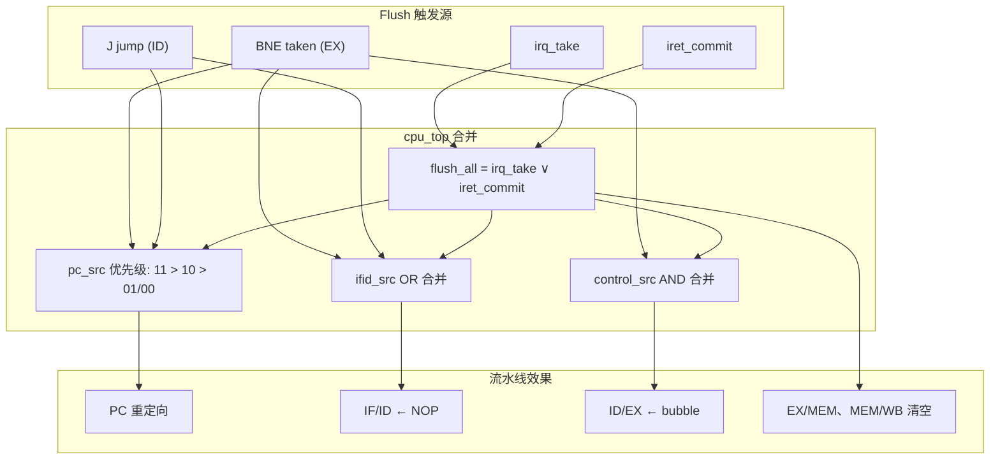

# 流水线 Flush（冲刷）说明

本文说明本课设五级流水 CPU 中 **flush** 的含义、触发场景、与 stall 的区别，以及在 `cpu_pipe/rtl/` 中的具体实现。

---

## 1. 什么是 Flush

五级流水线中，多条指令**同时在不同流水级执行**。当 CPU 在较晚的流水级才做出「改走另一条路」的决定时，IF 级已经按**旧 PC** 取进了若干条**不该执行**的指令。这些误取指若继续向下流动，会污染寄存器堆或内存。

**Flush（冲刷）** 的做法是：流水线**继续推进**，但把误取指及其控制信号**强行作废**——

- IF/ID 中的指令换成 **NOP**（全 0 编码）；
- ID/EX 插入 **bubble**（控制信号全 0，`valid=0`）；
- 必要时清空 EX/MEM、MEM/WB 的有效位。

同时 **PC 更新到新目标地址**，从正确位置重新取指。

一句话：**Flush = 继续走，但把错指令换成空操作扔掉。**

---

## 2. Flush 与 Stall 的区别

| 项目 | Stall（停顿） | Flush（冲刷） |
|------|---------------|---------------|
| 典型场景 | load-use 数据冒险、Cache miss | 分支/跳转控制冒险、中断/IRET |
| PC | **冻结**（`pc_en=0`） | **更新**到新地址（`pc_en=1`） |
| IF/ID | **保持**原内容（`ifid_en=0`） | **写入 NOP**（`ifid_src=1`） |
| ID/EX | **保持**原内容 | **写入 bubble**（`control_src=0`） |
| 流水线其它级 | 通常全部冻结 | 继续推进（分支 flush）；或全部清空（`flush_all`） |
| 效果 | 同一指令再等一拍 | 错指令被作废，不产生影响 |
| 典型例子 | `LD` 后下一条立刻用结果 | `BNE` 成立跳走；Timer 中断进入 ISR |

- **Stall**：「先别往前走，等数据或主存准备好。」
- **Flush**：「路已经错了，把已经取进来的废指令冲掉，改走新路。」

详见 [stall.md](./互锁问题/stall.md)、[BNE.md](../跳转指令/BNE.md) 第 4.1 节。

---

## 3. 本课设中的三种 Flush

### 3.1 总览

| 类型 | 判定阶段 | 冲刷范围 | 主要信号 | 实现位置 |
|------|----------|----------|----------|----------|
| **BNE 分支 flush** | EX | IF/ID ← NOP；ID/EX ← bubble | `hz_ifid_src`、`hz_control_src` | `hazard_unit.vhd` |
| **J 跳转 flush** | ID | IF/ID ← NOP；ID/EX ← bubble | `id_ex_jump`、`ifid_src`、`control_src` | `cpu_top.vhd` |
| **中断 / IRET flush** | WB 提交边界 | **全流水线**清空 | `flush_all` | `cpu_top.vhd` |

`cpu_top` 对 hazard_unit 输出与跳转、中断信号做**优先级合并**（见第 5 节）。

### 3.2 BNE 分支 Flush（EX 级，2 级冲刷）

`BNE` 在 **EX 级**比较 `rs1 ≠ rs2` 后才确定 `branch_taken`。在此之前 IF 已按 `PC+1` 顺序取指，至少误取 **1～2 条**指令。

**成立时下一拍：**

| 动作 | 信号 | 效果 |
|------|------|------|
| PC ← 分支目标 | `pc_src = 01` | 从 `branch_target` 重新取指 |
| IF/ID 指令 ← NOP | `ifid_src = 1` | 冲掉误取指 |
| ID/EX 控制 ← bubble | `control_src = 0` | 冲掉已译码的误取指控制 |
| PC 继续更新 | `pc_en = 1` | 与 stall 不同，不停顿 |

```text
周期 N:   BNE 在 EX，判定 taken
周期 N+1: PC ← target；IF/ID ← NOP；ID/EX ← bubble
周期 N+2: 目标处指令进入 IF
```

斐波那契循环中 `BNE` 跳回 `loop`（如 `0x0A → 0x04`）即依赖此机制；误取的 `HALT` 等指令被冲刷，不会执行。

实现见 `hazard_unit.vhd`：

```vhdl
pc_src      <= "01" when bne_taken = '1' else "00";
pc_en       <= '1';
ifid_en     <= '1';
ifid_src    <= bne_taken;
control_src <= '0' when bne_taken = '1' else '1';
```

### 3.3 J 跳转 Flush（ID 级，1 级冲刷）

无条件 `J` 在 **ID 级**译码即可确定跳转，`id_jump=1` 锁入 ID/EX 后为 `id_ex_jump`。

**只需冲刷 1 级误取指**（EX 级尚未有另一条误取指进入）：

| 动作 | 信号 | 效果 |
|------|------|------|
| PC ← 跳转目标 | `pc_src = 10` | `jump_target = id_ex_addr_target` |
| IF/ID ← NOP | `ifid_src = 1`（`id_ex_jump` 参与 OR） | 冲掉 IF 误取的 `PC+1` 指令 |
| ID/EX ← bubble | `control_src = 0`（由 hazard 默认 + 合并逻辑） | 视时序，J 主要冲 IF/ID |

```text
周期 T:   IF 取 PC+1（误取）；ID 译码 J
周期 T+1: PC ← target；IF/ID ← NOP；IF 从新地址取指
```

J 比 BNE **少冲一级**，因为判定更早。

### 3.4 中断 / IRET 全流水线 Flush（`flush_all`）

Timer 中断采用**精确中断**模型：在 **WB 级指令提交边界**（`wb_commit`）响应，再 flush 整条流水线。

```vhdl
flush_all <= irq_take or iret_commit;
```

| 事件 | 条件 | PC 去向 | 其它动作 |
|------|------|---------|----------|
| 进入 ISR | `irq_take` | `ISR_ADDR`（`0x0100`） | `EPC ← if_pc`；`IE ← 0`；`CAUSE ← 0x0001` |
| IRET 返回 | `iret_commit` | `EPC` | `IE ← 1` |

**与分支 flush 的区别：** `flush_all` 不仅冲 IF/ID、ID/EX，还清空 **EX/MEM、MEM/WB** 的 `valid` 与控制信号，避免中断前已在流水中的指令在 ISR 执行期间写回寄存器。

各级冲刷方式：

| 流水级 | flush 机制 |
|--------|------------|
| IF/ID | `ifid_src=1` → 指令 MUX 选 NOP |
| ID/EX | `control_src=0` → bubble，`id_ex_valid=0` |
| EX/MEM | `flush_all=1` → 控制与 `ex_mem_valid` 清零 |
| MEM/WB | `flush_all=1` → 控制与 `mem_wb_valid` 清零 |

详见 [Timer精确中断实现.md](../中断/Timer精确中断实现.md) 第 6.4 节。

---

## 4. 实现机制：NOP 与 Bubble

### 4.1 IF/ID 冲刷 — 指令 MUX

```vhdl
if_id_instr_in <= (others => '0') when ifid_src = '1' else if_instruction;
```

`ifid_src=1` 时，写入 IF/ID 的指令为全 0。在本 ISA 中全 0 不对应有效运算，后续级因控制为 0 也不会写寄存器或访存。

### 4.2 ID/EX 冲刷 — 插入 Bubble

`control_src=0` 时，ID/EX 进程不走正常锁存路径，而是将所有控制信号置 0，并令 `id_ex_valid <= '0'`：

```vhdl
if control_src = '0' then
  id_ex_reg_write  <= '0';
  id_ex_mem_read   <= '0';
  id_ex_mem_write  <= '0';
  -- ... 其余控制亦清 0
  id_ex_valid      <= '0';
else
  -- 正常从 ID 级锁存
end if;
```

Bubble 会随流水线**继续向下流动**，在 WB 级因 `reg_write=0` 不产生副作用。

### 4.3 EX/MEM、MEM/WB 冲刷 — 仅 `flush_all`

分支 / J 跳转**不**清空 EX/MEM、MEM/WB——误取指最多到 ID/EX，更早进入流水的指令是**合法**的。

仅 `flush_all`（中断进入或 IRET）时，在 `ex_mem_reg`、`mem_wb_reg` 进程中检测 `flush_all='1'` 并清零有效位与控制。

---

## 5. PC 源选择与优先级

`if_stage` 中 `pc_src` 编码：

| `pc_src` | 下一 PC |
|----------|---------|
| `00` | `PC + 1` |
| `01` | `branch_target`（BNE） |
| `10` | `jump_target`（J） |
| `11` | `pc_redirect`（ISR / EPC） |

`cpu_top` 合并逻辑（优先级从高到低）：

```vhdl
pc_redirect <= epc_reg when iret_commit = '1' else ISR_ADDR;

pc_src <= "11" when flush_all = '1' else
          "10" when id_ex_jump = '1' else hz_pc_src;

pc_en <= '0' when cache_stall = '1' else
         '1' when flush_all = '1' else hz_pc_en;

ifid_src <= '1' when hz_ifid_src = '1' or id_ex_jump = '1' or flush_all = '1' else '0';
control_src <= '0' when hz_control_src = '0' or flush_all = '1' else '1';
```



**注意：** `cache_stall=1` 时整条流水线冻结，`flush` 相关寄存器也不更新；中断响应同样要求 `cache_stall=0`，保证提交边界语义正确。

---

## 6. 时序示意

### 6.1 BNE 成立（斐波那契循环）

```text
地址:  0x04 ADD ...    0x05 ADDI ...    0x06 BNE ...    0x07 HALT    0x08 ...
       ─────────────────────────────────────────────────────────────────────
T0:    IF ADD           ID ...           EX ...          MEM ...     WB ...
T1:    IF ADDI          ID ADD           EX ...          MEM ...     WB ...
T2:    IF BNE           ID ADDI          EX ADD          MEM ...     WB ...
T3:    IF HALT(误取)    ID BNE           EX ADDI         MEM ADD     WB ...
T4:    IF ADD(0x04)    ID NOP           ID/EX bubble    EX BNE      MEM ADDI
       PC←0x04        冲掉 HALT        冲掉 HALT译码
T5:    IF ADDI          ID ADD           EX bubble       MEM BNE     WB ADDI
```

`BNE` 在 T3 的 EX 判定 taken；T4 改 PC 并冲刷两级误取指；T5 起循环恢复正常。

### 6.2 中断进入 ISR

```text
T0:    WB 级主程序指令提交 (wb_commit=1)，同时 irq_pending=1 且 IE=1
T1:    irq_take=1 → EPC←if_pc；PC←0x0100；flush_all 清空全流水
T2:    IF 从 ISR 取指；各级均为 bubble / 无效
```

WB 级**当前指令完整提交**后，才保存 EPC 并 flush——这是「精确中断」的含义。

---

## 7. 性能影响

无分支预测、静态「不预测」策略下，每次控制流改变都有 flush 代价：

| 事件 | 额外周期（约） |
|------|----------------|
| BNE 成立 | 2（IF/ID + ID/EX 误取） |
| J 跳转 | 1（IF 误取 1 条） |
| 中断 / IRET | 全流水清空 + 重新填流水 |

总周期估算：

```text
实际周期 ≈ 理想周期 + stall 周期 + flush 周期 + cache_miss_penalty
```

---

## 8. 仿真观察

ModelSim `run.do` 已添加 `flush_all` 波形：

```tcl
add wave sim:/tb_soc_top/u_dut/u_cpu/flush_all
```

建议同时观察：

| 信号 | 路径 |
|------|------|
| `ex_branch_taken` | `u_cpu/u_ex/` |
| `id_ex_jump` | `u_cpu/` |
| `ifid_src`、`control_src` | `u_cpu/` |
| `pc_src`、`pc_en` | `u_cpu/u_if/` |
| `irq_take`、`iret_commit` | `u_cpu/` |
| `if_id_instr` | 冲刷时应变为全 0 |

---

## 9. 相关源码

| 文件 | 职责 |
|------|------|
| `cpu_pipe/rtl/hazard_unit.vhd` | BNE 分支 flush 信号生成 |
| `cpu_pipe/rtl/cpu_top.vhd` | 信号合并、流水寄存器冲刷、`flush_all` |
| `cpu_pipe/rtl/if_stage.vhd` | `pc_src` MUX、PC 更新 |
| `cpu_pipe/rtl/ex_stage.vhd` | `branch_taken` 判定 |

---

## 10. 相关文档

| 文档 | 内容 |
|------|------|
| [BNE.md](../跳转指令/BNE.md) | BNE flush 与 bubble 代码对比 |
| [跳转指令.md](../跳转指令/跳转指令.md) | J / BNE flush 级数差异 |
| [HazardDetect.md](./互锁问题/HazardDetect.md) | Hazard Unit 总览 |
| [stall.md](./互锁问题/stall.md) | Stall 与 Flush 场景区分 |
| [halt.md](./halt.md) | HALT 停机逻辑、`halt_latched` 与 PC 冻结 |
| [Timer精确中断实现.md](../中断/Timer精确中断实现.md) | `flush_all` 与精确中断 |
| [中断相关名词解释.md](../中断/中断相关名词解释.md) | `flush_all`、`wb_commit` 名词 |
| [五级流水数据通路.md](../五级流水/五级流水数据通路.md) | 数据通路图中的 flush 标注 |

---

## 11. 验收检查清单

- [ ] `BNE` 成立时 PC 跳到 `branch_target`，循环结果正确（斐波那契 f7=13）
- [ ] 波形可见 IF/ID 指令在分支后变为 NOP（全 0）
- [ ] `J` 跳转后仅误取 1 条被冲掉
- [ ] 中断响应时 WB 级指令已提交，EPC 指向被 flush 的下一条主程序指令
- [ ] IRET 后 PC 恢复 EPC，误取 ISR 后续指被冲刷
- [ ] `cache_stall` 期间不发生 flush 寄存器更新或中断响应
