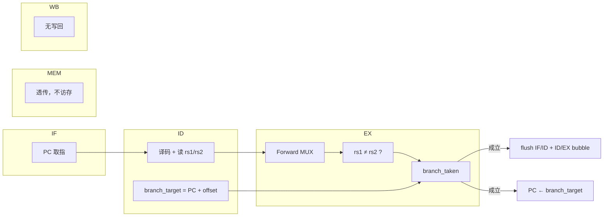

# BNE 指令执行流水梳理

以斐波那契程序中的 **`BNE x5, x0, LOOP`**（地址 `0x0A`，机器码 `4A3A`，offset = −6，目标 `0x04`）为例，对照当前 `cpu_pipe` RTL。

---

## 1. 指令语义与编码

```asm
BNE rs1, rs2, offset    ; if rs1 ≠ rs2 then PC ← PC_BNE + offset
```

**B 型格式**（16 bit）：

```text
| opcode(4) | rs1(3) | rs2(3) | offset(6，有符号) |
   0100       101      000      111010 (= -6)
```

| 字段 | BNE x5, x0, LOOP 取值 |
|------|----------------------|
| rs1 | x5（cnt） |
| rs2 | x0（恒为 0） |
| offset | −6 → 目标 PC = 10 + (−6) = 4（LOOP） |

**控制信号**（`id_stage` 译码）：

| 信号 | BNE 取值 | 含义 |
|------|----------|------|
| `branch` | 1 | 条件分支 |
| `reg_write` | 0 | 不写寄存器 |
| `mem_read/write` | 0 | 不访存 |
| `rd_src` | 0 | 第二操作数来自寄存器（非 imm） |

---

## 2. 五级流水总览



与 **J 指令** 的核心区别：

| | J | BNE |
|--|---|-----|
| 跳转判定 | **ID** 阶段（`jump=1`） | **EX** 阶段（`branch_taken`） |
| 目标地址 | ID 计算 `addr_target` | ID 计算，**EX 锁存后**才用于 PC |
| 误取指 | 1 条 | 2 条（IF/ID + ID/EX 各 1 条） |
| flush | 仅 IF/ID | IF/ID + ID/EX 控制 bubble |

---

## 3. 各级详细行为

### 3.1 IF — 取指

```text
instr_addr ← PC
instruction ← instr_memory[PC]
pc_plus1 ← PC + 1
```

BNE 在 IF 时与其他指令相同：按当前 PC 取指，结果锁入 **IF/ID**（`pc`、`instruction`）。

静态不预测：IF **总是** 取 `PC+1` 的下一条（地址 11 的 HALT），不管 BNE 最终是否跳转。

---

### 3.2 ID — 译码

**字段拆分**（`id_stage.vhd`）：

```text
rs_field  ← Ins[11:9]  = x5
rs2_field ← Ins[8:6]   = x0
imm6      ← Ins[5:0]   = offset
```

**读寄存器堆**（组合读）：

```text
rs_val  ← reg[x5]     → 锁入 id_ex_rs_val
rd_val  ← reg[x0] = 0 → 锁入 id_ex_rd_val（B 型第二操作数走 op2_data = rs2_data）
```

**分支目标**（ID 阶段提前算好）：

```text
addr_target = sign_ext(PC) + sign_ext(offset)
            = 10 + (-6) = 4
```

**锁入 ID/EX**（时钟沿）：

```text
{ pc, rs, rs2, rs_val, rd_val, imm_ext, addr_target,
  branch=1, reg_write=0, mem_read=0, mem_write=0, ... }
```

此时 BNE 还在 ID/EX 里，**尚不能** 决定跳转。

---

### 3.3 EX — 执行（BNE 的关键阶段）

BNE 进入 EX 时，ID/EX 中已有：

```text
id_ex_branch = 1
id_ex_rs = x5,  id_ex_rs2 = x0
id_ex_rs_val, id_ex_rd_val（可能已是旧值）
id_ex_addr_target = 4
```

#### (1) 数据转发

`forward_sel` 比较 **当前要读的寄存器号** 与 **EX/MEM、MEM/WB 的写目标**：

```text
forward_a ← forward_sel(id_ex_rs,  ...)   -- rs1 路径
forward_b ← forward_sel(id_ex_rs2, ...)   -- rs2 路径
```

典型场景（`ADDI x5,x5,-1` 在 EX/MEM，`BNE` 在 EX）：

```text
id_ex_rs = x5,  ex_mem_rd = x5  →  forward_a = 01
id_ex_rs2 = x0                  →  forward_b = 00
```

#### (2) Forward MUX 选操作数

```text
forward_rs_data ← ex_mem_alu   (forward_a=01，取 ADDI 刚算出的 cnt)
forward_rd_data ← rd_val_in    (forward_b=00，x0 = 0)
```

#### (3) 分支判定

```text
branch_taken = branch_in AND (forward_rs_data ≠ forward_rd_data)
             = 1 AND (cnt ≠ 0)
```

- `cnt ≠ 0` → `branch_taken = 1`，下一拍 PC 跳转
- `cnt = 0` → `branch_taken = 0`，顺序执行 HALT

#### (4) 输出到 EX/MEM

BNE 不写寄存器、不访存，EX/MEM 主要透传控制与分支信息：

```text
branch_taken, branch_target(=4), branch=1
reg_write=0, mem_read=0, mem_write=0
alu_result（无实际意义，BNE 不用写回）
```

---

### 3.4 MEM — 访存

BNE **不访问数据存储器**：`mem_read_en=0`，`mem_write_en=0`，信号原样传到 MEM/WB。

---

### 3.5 WB — 写回

`reg_write=0`，**不写寄存器堆**。BNE 只改 PC，不产生写回数据。

---

## 4. 控制冒险：分支成立时的 flush

`branch_taken` 在 **EX 组合逻辑** 算出，当拍末影响下一拍：

```text
branch_flush = ex_branch_taken OR id_ex_jump

pc_src = 01  when ex_branch_taken = 1   → PC ← branch_target (4)
```

**下一时钟沿**：

| 动作 | 效果 |
|------|------|
| PC ← 4 | 从 LOOP 重新取指 |
| IF/ID ← 0 | 冲掉误取的 HALT（地址 11） |
| ID/EX 控制 ← bubble | 冲掉 HALT 译码后的控制信号 |

由 `hazard_unit` 产生 `ifid_src`、`control_src` 等信号，`cpu_top` 完成 IF/ID 冲 NOP 与 ID/EX 插 bubble。

```text
周期 N:   BNE 在 EX，判定 taken
周期 N+1: PC=4；IF/ID=NOP；ID/EX= bubble
周期 N+2: ADD x3 在 IF 重新进入流水
```

### 4.1 Bubble（BNE flush）与 Stall（Cache）代码对比

BNE 分支冲刷用的是 **bubble**：流水线**继续推进**，把误取指换成 NOP。  
Cache miss 用的是 **stall**：整条流水线**冻结保持**，等主存 refill 完成。

#### 总览

| 项目 | Bubble（BNE flush） | Stall（Cache miss） |
|------|----------------------|---------------------|
| **触发** | `bne_taken = '1'` | `cache_stall = '1'`（`i_miss` 或 `cpu_ready='0'`） |
| **来源** | `hazard_unit` | `cache_control` |
| **PC** | **继续更新**（`pc_en='1'`，改向分支目标） | **冻结**（`pc_en='0'`） |
| **IF/ID** | **继续写**，指令强制 NOP | **不写**（hold） |
| **ID/EX** | **写入 bubble**（控制全 0） | **不写**（hold） |
| **EX/MEM、MEM/WB** | **继续推进** | **不写**（hold） |

#### Bubble：hazard_unit 输出

```vhdl
-- cpu_pipe/rtl/hazard_unit.vhd

-- BNE 成立时
pc_src      <= "01" when bne_taken = '1' else "00";  -- PC ← branch_target
pc_en       <= '1';                                   -- PC 照走
ifid_en     <= '1';                                   -- IF/ID 照写
ifid_src    <= bne_taken;                             -- 1 → 指令换 NOP
control_src <= '0' when bne_taken = '1' else '1';    -- 0 → ID/EX 插 bubble
```

#### Bubble：cpu_top 冲刷与插泡

```vhdl
-- cpu_pipe/rtl/cpu_top.vhd

-- IF/ID：ifid_src=1 时指令 ← 0（NOP）
if_id_instr_in <= (others => '0') when ifid_src = '1' else if_instruction;

-- IF/ID 寄存器：BNE 时仍更新（cache_stall=0 前提下）
if hz_ifid_en = '1' and cache_stall = '0' then
  if_id_pc    <= if_pc;
  if_id_instr <= if_id_instr_in;
end if;

-- ID/EX：control_src=0 时插入 bubble（控制信号全清）
if cache_stall = '0' then
  if control_src = '0' then
    id_ex_reg_write  <= '0';
    id_ex_mem_read   <= '0';
    id_ex_mem_write  <= '0';
    id_ex_branch     <= '0';
    -- ... 其余控制亦置 0
  else
    id_ex_reg_write  <= id_reg_write;
    id_ex_mem_read   <= id_mem_read;
    -- ... 正常锁入 ID 级控制
  end if;
end if;

-- EX/MEM、MEM/WB：bubble 时无额外门控，照常推进
```

BNE bubble 时各级行为：

```text
  PC      → 更新（跳到 branch_target）
  IF/ID   → 更新（写入 NOP，冲掉误取 HALT）
  ID/EX   → 更新（写入 bubble，控制=0）
  EX/MEM  → 更新（BNE 结果继续往下传）
  MEM/WB  → 更新
```

#### Stall：cache_control 输出

```vhdl
-- cpu_pipe/rtl/cache_control.vhd

stall <= i_miss or (not cpu_ready);
```

#### Stall：cpu_top 全局冻结

```vhdl
-- cpu_pipe/rtl/cpu_top.vhd

-- 冻结 PC（与 BNE 的 pc_en='1' 相反）
pc_en <= '0' when cache_stall = '1' else hz_pc_en;

-- 冻结 IF/ID（与 BNE 的 ifid_en='1' 相反）
if hz_ifid_en = '1' and cache_stall = '0' then
  if_id_pc    <= if_pc;
  if_id_instr <= if_id_instr_in;
end if;

-- 冻结 ID/EX（hold，不插 bubble）
if cache_stall = '0' then
  if control_src = '0' then ... else ... end if;
end if;

-- 冻结 EX/MEM
if cache_stall = '0' then
  ex_mem_alu_result <= ex_alu_result;
  -- ...
end if;

-- 冻结 MEM/WB
if cache_stall = '0' then
  mem_wb_mem_data <= mem_data;
  -- ...
end if;
```

Cache stall 时各级行为：

```text
  PC      → 保持
  IF/ID   → 保持
  ID/EX   → 保持
  EX/MEM  → 保持
  MEM/WB  → 保持
```

#### 核心差异（并排）

```vhdl
-- ========== BUBBLE（BNE）==========
pc_en       <= '1';              -- PC 照走，改向分支目标
ifid_en     <= '1';              -- IF/ID 照写
ifid_src    <= '1';              -- 但指令 ← NOP
control_src <= '0';              -- ID/EX ← bubble
-- EX/MEM、MEM/WB 无 stall 门控，照常更新

-- ========== STALL（Cache）==========
pc_en <= '0' when cache_stall='1' else hz_pc_en;     -- PC 冻结
-- IF/ID、ID/EX、EX/MEM、MEM/WB 全部：
if cache_stall = '0' then ... end if;                 -- 冻结 hold
```

#### 为何 BNE 用 bubble、Cache 用 stall

| 场景 | 机制 | 原因 |
|------|------|------|
| BNE 跳转 | bubble | 已知 `branch_target`，应立刻改 PC 并冲掉误取指；后面用 NOP 占位即可 |
| Cache miss | stall | 不知何时有数据，必须停在当前状态，等 refill 完成 |

**一句话**：bubble = 流水线还在动，把错的换成 NOP；stall = 整条流水线暂停，什么都别改。

---

## 5. 时序图（LOOP 末尾一轮）

以 `ADDI x5,x5,-1`（地址 9）紧接 `BNE x5,x0,LOOP`（地址 10）为例：

```text
周期:      T1   T2   T3   T4   T5   T6   T7   T8
─────────────────────────────────────────────────
ADDI x5:   IF   ID   EX   MEM  WB
BNE:            IF   ID   EX   MEM  WB
HALT(误取):          IF   ID   EX(bubble) ...
                              ↑
                         branch_taken=1
                         forward_a=01
─────────────────────────────────────────────────
周期 T5 各阶段并行:
  EX  = BNE        → 比较 forwarded x5 与 0
  EX/MEM = ADDI    →  ex_mem_alu = cnt-1
  IF  = HALT(误取) →  下一拍被 flush
```

**T5（BNE 在 EX）关键信号**：

| 信号 | 值 |
|------|-----|
| `id_ex_rs` | x5 |
| `ex_mem_rd` | x5 |
| `forward_a` / `ex_forward_rs` | `01` |
| `forward_rs_data` | `ex_mem_alu_result`（减 1 后的 cnt） |
| `forward_rd_data` | 0（x0） |
| `branch_taken` | cnt≠0 → 1 |

---

## 6. 数据通路与职责分工

```text
                    ID 阶段                    EX 阶段
              ┌─────────────────┐         ┌──────────────────────┐
  取指/译码   │ 读 rs1, rs2     │         │ Forward MUX          │
              │ branch_target   │────────►│ rs1 ≠ rs2           │
              │   = PC+offset   │         │ branch_taken         │
              │ branch=1        │         │ branch_target 透传   │
              └─────────────────┘         └──────────┬───────────┘
                                                     │
                                            branch_taken=1
                                                     │
                              ┌──────────────────────┴───────────┐
                              │ PC ← branch_target               │
                              │ IF/ID ← NOP, ID/EX ← bubble      │
                              └──────────────────────────────────┘
```

| 阶段 | BNE 做什么 | 不做什么 |
|------|-----------|----------|
| IF | 按 PC 取指 | 不预判分支 |
| ID | 读 rs1/rs2；算 `branch_target`；`branch=1` | 不比较、不跳转 |
| EX | 转发 + 比较；产生 `branch_taken` | 不写寄存器、不访存 |
| MEM | 透传 | 无 |
| WB | 无 | 无写回 |

---

## 7. 与 `forward_sel` 的关系

`forward_sel` 只做寄存器号匹配：

```text
EX/MEM 写 rd 且非 LD 且 rd = src_reg  →  01
MEM/WB 写 rd 且 rd = src_reg          →  10
否则                                  →  00
```

对 BNE 的调用：

```text
forward_a ← forward_sel(id_ex_rs,  ...)   -- rs1（x5）是否需转发
forward_b ← forward_sel(id_ex_rs2, ...)   -- rs2（x0）是否需转发
```

BNE 的 **跳转判定** 在 `ex_stage`：

```vhdl
branch_taken <= branch_in when forward_rs_data /= forward_rd_data else '0';
```

---

## 8. 当前 RTL 已实现 / 未实现

| 功能 | 状态 |
|------|------|
| ID 译码 BNE、读双寄存器 | ✅ |
| ID 算 `branch_target = PC + offset` | ✅ |
| EX 转发 + `branch_taken` | ✅ |
| 分支成立 PC ← target | ✅ |
| IF/ID flush + ID/EX bubble（`hazard_unit`） | ✅ |
| Cache miss stall（`cache_control`，与 bubble 机制不同） | ✅ |
| load-use stall | ❌ 未做 |
| CALL/RET 与 hazard 优先级表 | ❌ 未做 |

---

## 9. 一句话总结

**BNE 在 ID 准备好操作数和跳转目标，在 EX 经转发后比较 rs1≠rs2 得到 `branch_taken`；若成立则 PC 改向 `branch_target`，并 flush 已误取的两级指令。** 斐波那契循环里，`ADDI x5,x5,-1` 的结果通过 `forward_a=01` 旁路到 BNE 的 rs1，使 cnt 减 1 后立刻参与分支判断，无需等 WB 写回。

![[attachments/跳转指令.png]]