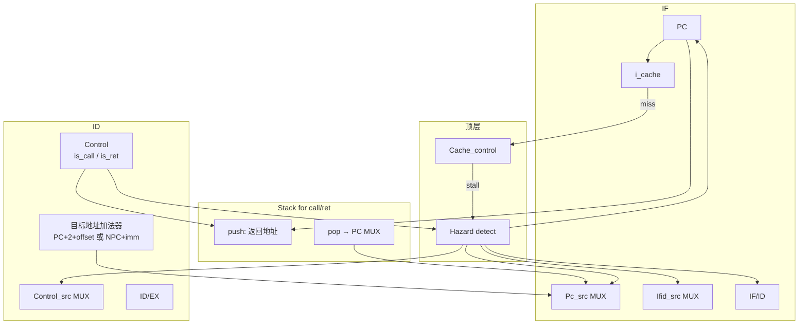

```
CALL 在 ID 被识别:
  Stack.push(返回地址)     ← 来自 Pc / IF/ID.NPC
  Stack.push(flags)        ← 来自 EX 当前 flags（或锁存的 czvs）

RET 在 ID 被识别:
  返回地址 → 送到 Pc_src MUX
  弹出 flags → 送到 flag 口，写回标志寄存器
  Hazard 可能同样要 flush 误取指
```

---

## 一、完整的 CALL 指令

### 1.1 指令格式（16 位

```text
| 15 ... 8 | 7 ... 0 |
|  opcode  | OFFSET  |
   Ins[15:8]  Ins[7:0]
```

| 字段 | 位宽 | 含义 |
|------|------|------|
| `opcode` | 8 | 操作码，`CALL` 独占一个码（例：`8'h90`，具体以你 Control 真值表为准） |
| `OFFSET` | 8 | 有符号偏移，参与算子程序入口 |

### 1.2 汇编语义

```asm
CALL  LABEL    ; 调用子程序 LABEL
```

**硬件做的两件事（同一拍在 ID 完成决策，下面细讲）：**

1. **压栈**：把 **返回地址** 写入 `Stack for call/ret`  
2. **改 PC**：`PC ← 子程序入口`（ID 段加法器算出来）

### 1.3 地址怎么算

课设里 JC 写：`PC + 2 + OFFSET`（`doc/6/跳转指令导致的流水线暂停.md`）。CALL 用同一套 **ID 段加法器**：

```text
返回地址  return_pc = CALL 指令的 PC + 1    （即 IF 里算的 PC+1，锁在 IF/ID 的 pc_plus1）
子程序入口 call_target = CALL 指令的 PC + 2 + sign_extend(OFFSET)
```

你图里 `Pc_src = 10`（二进制）就是选这个 **`call_target`** 去更新 PC。

**为何是 +1 和 +2？**  
- 当前 PC 指向 **CALL 本身**（地址 P）  
- 顺序下一条在 **P+1**（返回点）  
- 分支基址按课设习惯用 **P+2** 再加偏移（与 JC 一致）

> [!Tip] 
> OFFSET = label - (当前指令地址 + 2)
> NPC = Next Program Counter（下一条程序计数器）

|写法|例子（CALL 在 10，要去 20）|
|---|---|
|NPC + imm|若 NPC=11，则 imm = 20−11 = 9|
|P + 2 + OFFSET|P=10，则 OFFSET = 20−12 = 8|

### 1.4 完整例子

```asm
地址 10:  CALL  sub     ; OFFSET = sub_addr - 12，若 sub 在 20，则 OFFSET = 8
地址 11:  ADD  ...      ; 返回后从这里继续
...
地址 20:  sub:  ...      ; 子程序入口
```

| 量 | 计算 | 结果 |
|----|------|------|
| `return_pc` | 10 + 1 | **11** |
| `call_target` | 10 + 2 + 8 | **20** |
| 机器码（示意） | `opcode=90h`, `OFFSET=08h` | `16'h9008`（仅示例） |

### 1.5 Control 对 CALL 的输出（ID 译码）

| 控制信号 | CALL 取值 | 含义 |
|----------|-----------|------|
| `is_call` | 1 | 告诉 Hazard：这是 CALL |
| `RegWrite` | 0 | 不写通用寄存器 |
| `MemRead/MemWrite` | 0 | 不访存 |
| `Jump/Branch` | 0 | 不是 J/BNE，走 CALL 专用路径 |

---

## 二、执行 CALL 之前，流水线里有什么

假设 **周期 T** 开始时，CALL 刚进入 **IF**（上一条指令已在 ID/EX/…）：

```text
IF   : 正要取 CALL（PC=10）
ID   : 上一条普通指令
EX/MEM/WB : 更老的指令在跑
```

**重要：** CALL 的特殊控制 **不在取 CALL 的那一拍发**，而在 **CALL 进入 ID 的那一拍** 发（因为 Hazard 看的是 **IF/ID 里的指令**）。

---

## 三、从取指开始：逐拍、逐级、逐器件

下面用 **周期 T / T+1 / T+2** 说明。默认 **无 Cache miss、无 load-use**（有 miss 时后面单独说）。

---

### 周期 T — CALL 在 **IF 段**（正常取指，还没触发 CALL 冒险）

此时 Hazard **还不知道** 这是 CALL，输出是 **默认值**：

| 信号 | 值 | 作用 |
|------|-----|------|
| `Pc_en` | 1 | 允许 PC 更新 |
| `Pc_src` | `00` | 选 **PC+1** |
| `Ifid_en` | 1 | 允许 IF/ID 更新 |
| `Ifid_src` | 0 | IF/ID 接 **i_cache 来的真实指令** |
| `Control_src` | 1 | （对 ID 级下拍锁 ID/EX 用，本拍无关） |

#### IF 段：信号经过哪些器件（按数据流顺序）

```text
① PC_reg
   输入：上一拍末的 PC（=10）
   输出：当前地址 10 → 送给下面所有用地址的部件

② Pc_src 多路选择器（此时选 00）
   输入0：PC+1 结果（=11）  ← 被选
   输入1：Stack 弹出地址     （RET 用，本拍不用）
   输入2：ID 段 call_target  （本拍 ID 里还不是 CALL，无效）
   输出：11 → 若 Pc_en=1，周期末 PC←11（这是“预测失败”的顺取，下一拍会被改掉）

③ PC+1 加法器
   输入：PC(10)
   输出：11 → 接 Pc_src；同时作为 pc_plus1 送 IF/ID

④ i_cache（指令 Cache）
   输入：地址 = PC = 10
   输出：Inst = CALL 的机器码（如 9008h）
   侧信号：miss → Cache_control（本拍假设 miss=0，不 stall）

⑤ Ifid_src 多路选择器（此时选 0）
   输入0：i_cache 的 Inst     ← 被选
   输入1：常数 0（NOP）
   输出：CALL 指令字

⑥ IF/ID 流水线寄存器（Ifid_en=1）
   时钟沿锁存：
     pc        = 10
     pc_plus1  = 11        ← 以后压栈、算返回地址用  NPC
     instr     = CALL 码
```

**本拍小结：** 只做了一件事——**把 CALL 取进来，放进 IF/ID**。Stack、Hazard 的 CALL 动作 **都还没发生**。


> [!Tip] 
> miss:  CPU 向 Cache 要数据/指令，Cache 里没有
> 

---

### 周期 T+1 — CALL 在 **ID 段**（关键拍：Hazard + Stack + 改 PC）

此时 **IF/ID 里是 CALL**，IF 里已经按“顺序执行”多取了 **地址 11** 那条指令（误取）。

#### ① ID：Control 译码

```text
器件：Control
输入：IF/ID.instr[15:8] = CALL 的 opcode
输出：is_call = 1，RegWrite=0，…（其它控制位）
      is_call → 接到 Hazard detect
```

#### ② ID：Hazard detect 发出 CALL 那一行信号

```text
器件：Hazard detect
条件：is_call = 1（且 stall=0）
输出（你给的表）：
  Pc_src      = 10
  Pc_en       = 1
  Ifid_src    = 1
  Ifid_en     = 1
  Control_src = 1
```

#### ③ ID：算子程序入口（给 PC 用）

```text
器件：ID 段加法器（与 JC/JMP 共用）
输入：IF/ID.pc = 10，sign_extend(IF/ID.instr[7:0]) = OFFSET
计算：call_target = 10 + 2 + OFFSET = 20
输出：call_target → 接到 IF 段 Pc_src 的“10”那一路
```

#### ④ ID：Stack 压返回地址

```text
器件：Stack for call/ret
输入：Ins[15:8]（识别 CALL）、IF 级 PC 或更常用 IF/ID.pc_plus1
动作：push_en = 1，把 return_pc = 11 写入栈顶
输出：栈顶供以后 RET 用（本拍不改 PC 选栈）
```

**返回地址用谁？** 用 **IF/ID.pc_plus1（11）**，不要用本拍 IF 已变成 20 的 PC。

#### ⑤ 回到 IF：按 Hazard 信号改路

```text
器件：Pc_src MUX（选 10）
  → PC 下一值 = call_target = 20（不是 11）

器件：Pc_en = 1
  → 周期末 PC ← 20

器件：Ifid_src MUX（选 1）
  → 写入 IF/ID 的是 0（NOP），不是 IF 刚取到的“地址11”那条指令

器件：Ifid_en = 1
  → IF/ID 仍更新，但内容被冲成 NOP

i_cache：
  地址 = 新 PC 方向上的 20（下一拍才真正从 20 取到子程序第一条）
```

#### ⑥ ID：Control_src → ID/EX

```text
器件：Control_src MUX（选 1）
  → ID/EX 锁入 CALL 的真实控制（不是 bubble）
  → 但 CALL 通常不在 EX 做运算，后面各级当 NOP 流过即可
```

**本拍小结（三件事同时完成）：**

| 动作 | 用的器件 | 结果 |
|------|----------|------|
| 跳转到子程序 | ID 加法器 + Pc_src + PC | PC ← 20 |
| 冲掉误取指令 | Ifid_src + IF/ID | IF/ID ← NOP，不会执行“地址11”那条 |
| 保存返回点 | Stack | 栈里存入 11 |

---

### 周期 T+2 — 子程序第一条在 **IF**，流水线恢复正常

```text
IF   : PC=20，i_cache 取 sub 的第一条指令 → 进 IF/ID
ID   : IF/ID 里是上一拍冲进来的 NOP，很快被子程序指令覆盖；或 CALL 的控制在 ID/EX 空转
Stack: 栈顶仍是 11（等 RET 再弹）
Hazard: 默认信号 Pc_src=00, Ifid_src=0, …
```

**延迟：** 与课设“预测分支失败、成功跳多 1 拍”一致——**多浪费 1 个 IF 槽**（误取的那条被冲掉），不是 2 拍 BNE 那种双级 flush。

---

## 四、一张表串起「CALL 在 ID 拍」全通路

| 顺序 | 器件 | 输入从哪来 | 输出/作用 |
|------|------|------------|-----------|
| 1 | IF/ID | 上拍锁存的 CALL | 提供 pc、pc_plus1、instr |
| 2 | Control | instr[15:8] | `is_call=1` |
| 3 | Hazard detect | `is_call` | Pc_src=10, Pc_en=1, Ifid_src=1, Ifid_en=1, Control_src=1 |
| 4 | ID 加法器 | pc, OFFSET | `call_target=20` → Pc_src |
| 5 | Stack | pc_plus1, is_call | push(11) |
| 6 | Pc_src MUX | call_target | 下拍 PC=20 |
| 7 | Ifid_src MUX | 0 | IF/ID 冲 NOP |
| 8 | i_cache | PC→20 | 下拍取子程序代码 |

---

## 五、时序简图

```text
        IF 段              ID 段                 Stack
T:      取 CALL@10        上一条指令             —
        IF/ID←{10,11,CALL}

T+1:    误取@11           译码 CALL              push(11)
        Hazard→PC←20      is_call→Hazard
        IF/ID←NOP(冲掉11)

T+2:    取 sub@20         NOP/子程序指令          栈顶=11
```

---

## 六、若本拍有 Cache miss

`Cache_control` 拉高 `stall` → Hazard **不发** CALL 那行，而是 `Pc_en=0, Ifid_en=0, Control_src=0`：

- CALL **停在 IF/ID**，不 push、不改 PC  
- miss 结束后，再在 ID 拍执行上一节的 T+1 动作  

---

## 七、和 JMP 的差别

| | JMP | CALL |
|--|-----|------|
| Hazard 信号表 | 通常相同（Pc_src=10, Ifid_src=1…） | **相同** |
| ID 加法器 | 算跳转目标 | 算跳转目标（公式可相同） |
| Stack | **不操作** | **push(return_pc)** |
| 返回 | 无 | 靠 **RET** 弹栈 |

---

## 2. 整体协作关系（一张图）



**分工：**

- **Hazard detect**：发现 CALL → 发你表里的 5 个信号（控制冒险 + 1 级 flush）。
- **Stack for call/ret**：在 CALL 拍 **压返回地址**；RET 时 **弹栈送 PC**（走 `Pc_src` 另一档，通常是 `01` → 栈顶）。
- **Cache_control**：任一级 cache **miss** → `stall=1`，**压过** CALL 的跳转控制，整流水线冻结（与 load-use / 互锁相同）。


## 5. Hazard detect 中 CALL 的检测条件（建议 RTL）

```vhdl
-- 与图中连线一致
call_detect <= is_call;   -- Control 对 Ins[15:8] 译码

-- 仅当无更高优先级冒险时才响应 CALL
call_take <= call_detect
             and not stall
             and not load_use_stall
             and not branch_flush_ex;  -- 若 BNE 在 EX

when call_take = '1' =>
    pc_src      <= "10";
    pc_en       <= '1';
    ifid_src    <= '1';
    ifid_en     <= '1';
    control_src <= '1';
```

**与 JMP 的区别**只在 **Stack.push**，Hazard 输出表可以相同。

## 3. `stack_for_call`：压栈专用数据通路

`stack_for_call` 由 **Control** 在译码 CALL 时置 1，并随 **ID/EX → EX/MEM → MEM/WB** 的控制字段向后传（与 `MemWrite` 等一起）。

### 3.1 Control 对 CALL 的扩展控制（除 Jump 外）

| 控制位 | CALL 时值 | 含义 |
|--------|-----------|------|
| `stack_for_call` | 1 | 启用“为 CALL 压栈”的专用 MUX |
| `MemWrite` / `mem_write` | 1 | MEM 级向数据存储器写 |
| `RegWrite` | 0 | 不写通用寄存器 |
| `MemRead` | 0 | 非 Load |

### 3.2 与图中 SP、EX/MEM 的配合

图中 **SP 在 EX 段**，典型实现如下：

```text
stack_for_call = 1 时：

  访存地址 MUX:  addr ← SP          （不用 EX 主 ALU 的 alu_result）
  写数据 MUX:    Write_Data ← 返回地址
                 （CALL 在 ID 时锁入 ID/EX 的 NPC，经流水线送到 MEM）

  SP 更新（压栈，栈向低地址生长）:
    SP_new ← SP - 1    （在 EX 或 EX/MEM 边界更新 SP 寄存器）
```

要点：

1. **返回地址**必须在 CALL 处于 ID 时把 `IF/ID.NPC` 锁进 **ID/EX**（类似锁 `pc` 做 BNE），否则冲掉 IF/ID 后会丢返回地址。  
2. **栈顶地址**用 **SP**，不用寄存器间接的 `rs`。  
3. CALL 在 **MEM** 拍才真正写栈；跳转在 **T 末** 已改 PC，二者可并行、不冲突。